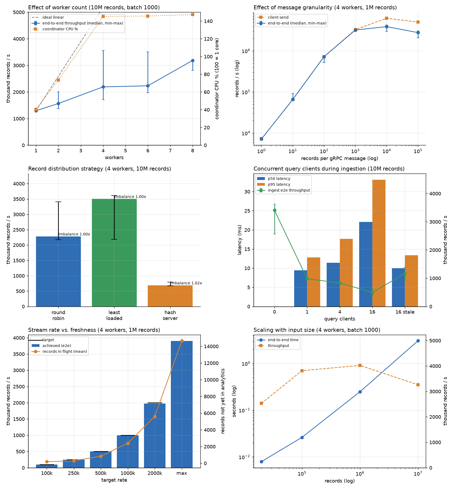

# HW3 Q2 — Real-Time Server Log Analytics using gRPC

The HW2 Q7 problem (**large-scale server log analytics**), now processed as a
**live stream** instead of a batch. A streaming client replays a pre-generated
log file record batch by record batch over gRPC; a coordinator routes the
records to multiple analytics workers; a CLI dashboard shows the analytics
changing while the stream is still arriving. When the stream ends, the final
analytics are **byte-for-byte identical** to HW2's sequential program.

Written in Python (grpcio). Every analytic from HW2 Q7 is maintained:
total/successful/failed requests, average/min/max response time, total bytes,
2xx/3xx/4xx/5xx counts, Top-K servers (with average response time), Top-K
endpoints (with total bytes) and the busiest 60-second interval.

---

## Contents

1. [File structure](#1-file-structure)
2. [Quick start (local)](#2-quick-start-local)
3. [Architecture](#3-architecture)
4. [gRPC interface](#4-grpc-interface)
5. [Design decisions](#5-design-decisions)
6. [Running on the RCE cluster](#6-running-on-the-rce-cluster)
7. [The CLI dashboard](#7-the-cli-dashboard)
8. [Correctness verification](#8-correctness-verification)
9. [Performance evaluation](#9-performance-evaluation)
10. [Datasets and reproducibility](#10-datasets-and-reproducibility)
11. [Limitations](#11-limitations)
12. [Conclusion](#12-conclusion)

---

## 1. File structure

```
Q2_grpc/
├── README.md                  this file
├── Makefile                   stubs, reference tools, data, verification
├── requirements.txt
│
├── proto/
│   └── loganalytics.proto     the gRPC interface (LogAnalytics + Worker services)
│
├── src/                       the system
│   ├── analytics.py             the Q7 logic: mergeable state, merging, exact output format
│   ├── coordinator.py           gRPC server: ingestion, routing, delta merge, queries
│   ├── worker.py                analytics worker: counts batches, serves deltas
│   ├── stream_client.py         replays a dataset as a stream (batch size / rate / speed-up)
│   ├── query_client.py          prints the analytics in HW2 format; query load tester
│   ├── dashboard.py             live CLI dashboard
│   └── loganalytics_pb2*.py     generated by `make proto`
│
├── reference/                 copied unchanged from HW2 Q7
│   ├── log_seq.cpp, common.*    the sequential program = correctness reference
│   └── gen_dataset.cpp          the dataset generator
│
├── scripts/
│   ├── cluster.py               starts coordinator + W workers locally (tests, benchmarks)
│   ├── verify.py                correctness suite (207 checks)
│   ├── bench.py                 performance experiments -> results/bench_*.csv
│   ├── plot.py                  results/bench_*.csv -> results/q2_plots.png
│   ├── make_data.sh             datasets with fixed seeds
│   ├── run_local.sh             start the system in the background on one machine
│   ├── rce_setup.sh             one-time setup on RCE
│   ├── rce_start.sh             start the system across an interactive allocation
│   └── rce_bench.sh             multi-node benchmark + correctness check (sbatch)
│
├── tests/                     hand-made inputs: HW2 worked example + edge cases
└── results/                   verification.txt, bench_*.csv, q2_plots.png, logs
```

`src/analytics.py` is the only place the analytics are defined. The worker uses
it to count, the coordinator uses it to merge, and the query client and
dashboard use it to print — the same "one copy of the logic" rule HW2 used with
`common.cpp`.

---

## 2. Quick start (local)

```bash
cd Q2_grpc
python3 -m pip install -r requirements.txt
make                        # gRPC stubs + HW2 log_seq and gen_dataset
bash scripts/make_data.sh   # tiny / small / medium / large datasets (fixed seeds)
```

Start 4 workers and the coordinator in the background:

```bash
bash scripts/run_local.sh 4 round_robin
```

Then, each in its own terminal, from `src/`:

```bash
python3 dashboard.py localhost:50051                                  # live view
python3 stream_client.py localhost:50051 ../data/medium.in --rate 100000
python3 query_client.py localhost:50051                               # analytics right now
python3 query_client.py localhost:50051 --final                       # after the stream ends
```

Check it against HW2, and stop:

```bash
python3 query_client.py localhost:50051 --final > grpc.txt
../bin/log_seq ../data/medium.in > seq.txt
diff seq.txt grpc.txt && echo "SAME"
bash ../scripts/run_local.sh stop
```

Without `run_local.sh`, the processes are started by hand:

```bash
python3 worker.py 0.0.0.0:50061
python3 worker.py 0.0.0.0:50062
python3 coordinator.py 0.0.0.0:50051 --workers localhost:50061,localhost:50062
```

---

## 3. Architecture

```
                         ┌───────────────────────────── Coordinator ─────────────────────────────┐
                         │                                                                        │
 stream_client ──────────┼─▶ StreamRecords ──▶ router ──┬──▶ queue[0] ──▶ sender ──Process()──────┼──▶ Worker 0
 (replays dataset,       │   (client stream)  round_robin├──▶ queue[1] ──▶ sender ──Process()──────┼──▶ Worker 1
  batch size, rate)      │                   least_loaded│        ... bounded queues               │      ...
                         │                   hash_server └──▶ queue[W-1]▶ sender ──Process()──────┼──▶ Worker W-1
 stream_client #2 ───────┼─▶ StreamRecords ──▶ (same router)                                      │   (count into
                         │                                                                        │    mergeable
 dashboard ──────────────┼─▶ WatchAnalytics ─┐                                                    │    Stats)
 (server stream)         │                   ├─▶ snapshot ◀── global Stats ◀── merge ◀── sync ────┼──PullDelta()──┘
 query_client (×C) ──────┼─▶ GetAnalytics ───┘                     (single-flight, exactly-once)  │
                         └────────────────────────────────────────────────────────────────────────┘
```

**Stream client** — reads the `N K S` header and the records, packs them into
columnar batches and sends them over one client-streaming RPC. Rate, batch size
and timestamp-based replay speed are configurable (§5.6).

**Coordinator** — the gRPC server that receives the stream. It does three jobs:

1. *Routing.* Each incoming batch goes to a worker's bounded queue, chosen by the
   distribution strategy. One sender thread per worker drains that queue into a
   single long-lived `Worker.Process` stream, so there is no per-batch RPC setup.
2. *Maintaining global state.* The coordinator pulls **deltas** from every worker
   (`Worker.PullDelta`) and merges them into one global `Stats`. This is an
   incremental version of HW2's `MPI_Reduce`: counts and sums are added,
   minimums and maximums are compared.
3. *Answering queries.* `GetAnalytics` and `WatchAnalytics` build a snapshot
   (Top-K, busiest interval, system status) from the merged state.

**Workers** — separate processes, possibly on separate nodes. A worker counts
each batch into a mergeable `Stats` object and keeps it until the coordinator
pulls it. Workers never talk to each other.

**Dashboard / query clients** — read-only clients of the coordinator. Any number
of them can run while data is being ingested.

### Life of a record

1. `stream_client` puts it in a `RecordBatch` → `IngestMessage` → `StreamRecords`.
2. The coordinator's router picks a worker and puts the batch in its queue. If the
   queue is full, `put()` blocks → the handler stops reading → gRPC flow control
   slows the client down. **Backpressure is end-to-end**, so memory stays bounded.
3. The sender thread yields the batch into the worker's `Process` stream.
4. The worker counts it under its lock (`Stats.add_columns`).
5. On the next sync (background every 0.5 s, or triggered by a fresh query), the
   worker's delta is pulled and merged. From that moment the record is visible
   in every query. `records_processed == total_requests` holds in every snapshot.

### How the analytics stay correct when split

Same argument as HW2: every stored quantity is a **count, sum, min or max**, and
those combine exactly. Averages are computed only when printing. Top-K is chosen
**after** merging the full per-server and per-endpoint counts, never from each
worker's local top K (a server second-best on every worker can be first
overall). The busiest interval is kept as a running maximum while merging,
which is exact because interval counts only grow; ties go to the earliest
interval, as in HW2.

---

## 4. gRPC interface

Full definition: [proto/loganalytics.proto](proto/loganalytics.proto).

### Service `LogAnalytics` (coordinator, port 50051)

| RPC                                                          | Kind             | Purpose                                                                                                                        |
| ------------------------------------------------------------ | ---------------- | ------------------------------------------------------------------------------------------------------------------------------ |
| `StreamRecords(stream IngestMessage) → IngestSummary`     | client streaming | ingestion: a`StreamHeader` (N K S), then any number of `RecordBatch`                                                       |
| `GetAnalytics(AnalyticsQuery) → AnalyticsSnapshot`        | unary            | analytics at this moment;`fresh` pulls deltas first, `wait_for_completion` blocks until every streamed record is processed |
| `WatchAnalytics(WatchRequest) → stream AnalyticsSnapshot` | server streaming | the coordinator pushes a snapshot every interval (used by the dashboard)                                                       |
| `Reset(ResetRequest) → ResetResponse`                     | unary            | clears coordinator and workers; refused with`FAILED_PRECONDITION` while a stream is active                                   |

### Service `Worker` (each worker, port 50061)

| RPC                                                   | Kind             | Purpose                                                   |
| ----------------------------------------------------- | ---------------- | --------------------------------------------------------- |
| `Process(stream RecordBatch) → ProcessAck`         | client streaming | one long-lived stream per worker carrying all its batches |
| `PullDelta(PullRequest{ack_epoch}) → PartialStats` | unary            | everything counted since the last*acknowledged* delta   |
| `Reset`                                             | unary            | clears the worker                                         |

### Messages that matter

**`RecordBatch`** is **columnar**: one packed `repeated` field per column
(`timestamp`, `server_id`, `endpoint_id`, `user_id`, `status_code`,
`response_time_micro`, `bytes_sent`). A batch of 1000 records is 7 packed arrays,
not 1000 nested messages. Packed scalars are decoded in C by protobuf, and the
worker can `zip()` the columns directly.

**`PartialStats`** carries a worker's delta: the scalar counters plus the maps
(per server, per endpoint, per interval) as parallel packed arrays, which is
faster than proto `map<>` in Python. It includes the cumulative
`records_processed` and the delta's `epoch`.

**`AnalyticsSnapshot`** has every Q7 value as an **exact integer** (response-time
sums in micro-units, so the client computes the average), the Top-K rows, and
system state for the dashboard: records ingested and processed, ingest and
process rates, per-worker routed/processed/queue depth/health, strategy,
snapshot version, and a `complete` flag.

### Why this shape

- **Streaming ingestion** (client streaming) — one RPC for a whole stream avoids
  per-record connection and header overhead, and gRPC flow control gives
  backpressure for free.
- **Pull, not push, for results** — workers never need to know who is asking
  or how often. Query frequency and ingestion are decoupled; with no queries,
  the only merge cost is the background sync.
- **Both unary and server-streaming queries** — `GetAnalytics` suits scripts
  and latency measurement; `WatchAnalytics` suits a dashboard, which otherwise
  would poll.
- **Separate `Worker` service** — the coordinator↔worker protocol is internal
  and differs from the public one; keeping it in its own service makes that
  boundary explicit.

---

## 5. Design decisions

### 5.1 Python

HW3's general instructions allow C++ or Python. The RCE gRPC guide uses
Python, and gRPC's Python API keeps the concurrency code (streams, thread pools,
condition variables) short enough to reason about. Throughput was the risk, so
the hot paths are designed to push work into C:

- columnar batches: protobuf decodes the packed arrays in C;
- the client converts whole columns with `map(int, ...)`;
- workers are **processes**, not threads, so they do not share an interpreter lock.

With Python 3.14 a worker counts **~2.7 M records/s** (1 M records in 0.37 s).

### 5.2 Exact integer arithmetic

HW2 summed response times as `double`. When sums from several workers are
combined in varying order, the last bits can differ. Here `response_time` is
converted once, at the client, to an integer number of micro-units
(`76.393 → 76393000`). Every sum is then an exact Python integer, so the
merged result is independent of how records were split or when they were
pulled. For printing, `Fraction(sum, count)` is converted to the nearest double
and formatted with `%.6f`, which reproduces HW2's `printf` output. This matters
in practice: `tests/edge_odd.in` contains a server whose average is exactly
`500002.7499995`, a rounding tie, and the output still matches HW2.

### 5.3 Delta pulls with exactly-once merging

A worker keeps `current` (records since the last cut) and `pending` (the last
delta sent, numbered `epoch`). Each `PullDelta` carries the epoch the
coordinator last merged:

| Request's`ack_epoch`  | Worker does                                                                                          |
| ----------------------- | ---------------------------------------------------------------------------------------------------- |
| equals`pending.epoch` | the delta arrived: drop it, cut`current` into a new delta with `epoch + 1`                       |
| anything else           | the previous reply was lost: fold`current` into `pending`, re-send with the **same** epoch |

The coordinator merges a delta only if `epoch > last_epoch` for that worker. A
lost or timed-out reply therefore causes neither lost nor double-counted
records. Deltas also keep syncs cheap: only servers, endpoints and intervals
touched since the last pull are sent, not the full state.

### 5.4 Concurrency control

| Shared state                                              | Protection                                                                                           |
| --------------------------------------------------------- | ---------------------------------------------------------------------------------------------------- |
| worker`Stats` (Process stream vs. PullDelta)            | one lock per worker; a batch is counted atomically; the delta is serialised outside the lock         |
| coordinator global`Stats` + per-worker processed counts | `state_lock`; snapshots read analytics and progress under the same lock, so `total == processed` |
| routing counters, active stream count                     | `ingest_lock`                                                                                      |
| worker queues                                             | `queue.Queue` (thread-safe, bounded → backpressure)                                               |
| syncs                                                     | **single-flight** condition variable (below)                                                   |
| built snapshots                                           | cached per (merge version, K); later queries on the same version copy it instead of re-ranking Top-K |

**Single-flight sync.** A fresh query needs a sync that *starts after* it
arrives. If one is already running, the query waits for the next one, and every
query that arrives meanwhile shares it. With 16 concurrent query clients, the
workers see one pull round at a time instead of 16 overlapping ones. Pulls to
the W workers inside a round run in parallel.

Multiple ingestion streams can be active at once. Each is handled on its own
server thread and they share the router (tested with two sources in §8).

### 5.5 Record distribution strategies

| Strategy         | How                                                | Cost at the coordinator         | Balance                                |
| ---------------- | -------------------------------------------------- | ------------------------------- | -------------------------------------- |
| `round_robin`  | whole batches, in turn                             | O(1) per batch                  | even when batches are equal size       |
| `least_loaded` | whole batch to the shortest queue                  | O(W) per batch                  | adapts to slow or busy workers         |
| `hash_server`  | each record to`server_id % W` (key partitioning) | O(records): split and re-encode | follows the key distribution → skewed |

`hash_server` is what a system needs when per-key state must live on one worker
(for example, per-server windows). Q7's analytics are all mergeable, so key
affinity is not required. §9 measures what it costs.

### 5.6 Streaming controls

| Option             | Effect                                                           |
| ------------------ | ---------------------------------------------------------------- |
| `--batch-size B` | records per gRPC message (B = 1 streams record by record)        |
| `--rate R`       | target records/second (paced per batch)                          |
| `--speedup X`    | replay by the records' own timestamps, X× faster than real time |
| `--preload`      | encode everything before streaming, so only streaming is timed   |

Coordinator options: `--strategy`, `--queue-cap` (backpressure bound, default
64 batches per worker), `--sync-interval` (background pull period, default
0.5 s; 0 = only on query).

---

## 6. Running on the RCE cluster

### One-time setup (login node)

```bash
# on the laptop
rsync -avz --exclude data --exclude bin Q2_grpc/ cs3401.26@rce.iiit.ac.in:~/HW3/Q2_grpc/
# on RCE
cd ~/HW3/Q2_grpc
bash scripts/rce_setup.sh      # venv, pip install, make proto, make tools, datasets
```

RCE's default `python3` is 3.6, which current `grpcio` no longer supports, so
`rce_setup.sh` creates a virtualenv `~/HW3/venv` from the cluster's Python 3.12
(`/usr/local/apps/python-3.12.5`). Home is shared, so every compute node uses the
same venv. `rce_start.sh` and `rce_bench.sh` call `~/HW3/venv/bin/python3`; in an
interactive shell run `source ~/HW3/venv/bin/activate` first.

`make proto` is re-run on the cluster because the generated stubs check that the
installed `grpcio` is at least the version that generated them.

### Interactive demo (as in the RCE execution guide)

```bash
salloc --nodes=4 --ntasks-per-node=1
scontrol show hostnames $SLURM_JOB_NODELIST      # e.g. node01 node02 node03 node04
bash scripts/rce_start.sh                        # coordinator on node01, workers on node02-04
```

Then, in separate terminals:

```bash
ssh node02; source ~/HW3/venv/bin/activate; cd ~/HW3/Q2_grpc/src
python3 dashboard.py node01:50051

ssh node03; source ~/HW3/venv/bin/activate; cd ~/HW3/Q2_grpc/src
python3 stream_client.py node01:50051 ../data/large.in --rate 200000

ssh node04; source ~/HW3/venv/bin/activate; cd ~/HW3/Q2_grpc/src
python3 query_client.py node01:50051              # while streaming
python3 query_client.py node01:50051 --final > grpc.txt
../bin/log_seq ../data/large.in | diff - grpc.txt && echo SAME
```

`bash scripts/rce_start.sh stop` ends the workers and coordinator. Clients must
use the node hostname (`node01:50051`), never `localhost`. Servers listen on
`0.0.0.0`.

### Batch benchmark

```bash
sbatch scripts/rce_bench.sh data/large.in
```

It uses 6 nodes: coordinator, client, and one node per worker. It sweeps worker
counts, batch sizes, strategies and query clients, diffs every run's final
output against `log_seq`, and writes `results/rce_<jobid>.jsonl`.

---

## 7. The CLI dashboard

```bash
python3 dashboard.py node01:50051 [--interval 0.5] [--k 10] [--poll] [--once]
```

It subscribes to `WatchAnalytics` (`--poll` uses `GetAnalytics` instead and shows
per-query latency). It redraws in place and adapts to terminal width: side by
side at 100+ columns, stacked below that.

A frame captured mid-stream (4 workers, `medium.in` streamed at 200,000 rec/s, `--once`):

```
 LOG ANALYTICS  |  coordinator localhost:50051  |  23:22:22
 Status   STREAMING (1 source)   strategy round_robin   uptime 00:00:04   snapshot v11
 Progress ███████████████████████▉  99.8%  processed 560,000 / ingested 561,000  (in flight 1,000)
 Rates    ingest   194,262 rec/s   process   193,916 rec/s   query 4.8 ms
 Activity █

 WORKERS
  #   address                       routed     processed  queue  share of processed
  0   localhost:50061              141,000       140,000      1  ████              25.0%
  1   localhost:50062              140,000       140,000      0  ████              25.0%
  2   localhost:50063              140,000       140,000      0  ████              25.0%
  3   localhost:50064              140,000       140,000      0  ████              25.0%

 REQUESTS                                            RESPONSE TIME
  total               560,000                         average      500.540527
  successful          514,941 ( 92.0%)                minimum        0.001000
  failed               45,059 (  8.0%)                maximum      999.999000
  bytes sent   26,053,763,174 (24.3 GiB)
  servers 128  endpoints 1,024  intervals 5,627      BUSIEST 60s INTERVAL
                                                      id 28335653  with 3,600 requests

 STATUS CODES
  2xx █████████████████████████▍      85.0%  475,870
  3xx ██                               7.0%  39,071
  4xx █▊                               6.0%  33,813
  5xx ▌                                2.0%  11,246

 TOP 10 SERVERS                                      TOP 10 ENDPOINTS
  rank server       requests       avg resp           rank endpoint     requests        total bytes
  1    10             10,869     496.981632           1    62              4,713        222,522,972
  2    8              10,819     497.771082           2    33              4,706        216,928,568
  3    12             10,788     496.163545           3    3               4,703        216,322,208
  4    2              10,785     496.352065           4    49              4,695        215,906,343
  5    15             10,784     503.739589           5    23              4,691        217,087,598
  6    19             10,782     501.847008           6    42              4,691        219,129,084
  7    16             10,770     504.317614           7    12              4,685        219,055,694
  8    17             10,768     501.863647           8    18              4,678        218,323,520
  9    26             10,765     504.507674           9    53              4,677        218,450,413
  10   32             10,757     505.680946           10   35              4,670        216,103,015

 Ctrl-C to quit the dashboard (the system keeps running)
```

- **Status**: STREAMING / DRAINING (stream ended, records still in flight) /
  COMPLETE / IDLE.
- **Progress**: records merged vs. received, and how many are in flight.
- **Rates** and the **activity** sparkline: records/s in and records/s merged.
- **Workers**: routed vs. processed, queue depth (backpressure), share of the
  work, and DOWN if a worker failed.
- Every Q7 analytic, updated live.

---

## 8. Correctness verification

**Reference:** HW2's sequential program, `reference/log_seq.cpp`, copied
unchanged. Rule: the final analytics printed by `query_client.py --final` must
be **byte-for-byte identical** to `log_seq`'s output.

```bash
make verify            # or: python3 scripts/verify.py
```

Result file: [results/verification.txt](results/verification.txt).
**207 / 207 checks passed.**

| What                                              | Configurations                                          |
| ------------------------------------------------- | ------------------------------------------------------- |
| HW2 worked example + 5 edge-case files            | × workers {1,2,3,4} × 3 strategies × batch {1, 3}    |
| `tiny.in` (20k)                                 | × 12 cluster configs × batch {1, 7}                   |
| `small.in` (100k)                               | × 12 configs × batch {64, 1000}                       |
| `medium.in` (1M)                                | × 12 configs × batch 5000                             |
| Reset between runs                                | every run above reuses its cluster after`Reset`       |
| 2 sources streaming halves of`small.in` at once | equals the whole file                                   |
| query-time`K = 3`                               | equals`log_seq` on the file with K = 3                |
| live queries during a 1M stream                   | 3,498 snapshots, 3,338 taken mid-stream, all consistent |
| `large.in` (10M), 4 workers                     | `round_robin` and `hash_server`, identical          |

Edge-case inputs in `tests/`:

| File               | Checks                                                                                                                                                                                                                       |
| ------------------ | ---------------------------------------------------------------------------------------------------------------------------------------------------------------------------------------------------------------------------- |
| `sample.in`      | the worked example from the HW2 README                                                                                                                                                                                       |
| `edge_empty.in`  | N = 0: all zeros,`BUSIEST_INTERVAL 0 0`, empty lists                                                                                                                                                                       |
| `edge_single.in` | one record, status 503                                                                                                                                                                                                       |
| `edge_odd.in`    | negative server/endpoint ids (ignored, as HW2), status 100/199/600 (in totals, no bucket), negative timestamps (C truncation for`timestamp/60`), bytes > 2³², 6-decimal response times, a rounding tie, K > distinct ids |
| `edge_ties.in`   | equal server counts, equal endpoint counts, equal interval counts (earliest wins)                                                                                                                                            |
| `edge_k0.in`     | K = 0                                                                                                                                                                                                                        |

The live-query check verifies, for every snapshot taken while ingesting, that
`total == records_processed ≤ records_ingested`, `successful + failed == total`,
and that neither totals nor snapshot versions ever go backwards. Together with
exact final results, this shows that concurrent queries neither see partial
batches nor disturb ingestion.

---

## 9. Performance evaluation

### 9.1 Setup

| Item      | Value                                                                                                                                        |
| --------- | -------------------------------------------------------------------------------------------------------------------------------------------- |
| Machine   | laptop, Intel Core i5-1245U: 2 performance + 8 efficiency cores, 12 hardware threads, 30 GB RAM                                              |
| Software  | Python 3.14.4, grpcio 1.84.0, protobuf 7.36.1, Ubuntu (Linux 7.0)                                                                            |
| Placement | coordinator, W workers, stream client and query clients all as**separate processes on this one machine**, over TCP loopback            |
| Procedure | fresh coordinator + workers per run, client`--preload` (file parsing not timed), **3 runs per configuration: median, with min–max** |
| Metric    | **end-to-end throughput** = records ÷ (first record sent → last record merged into the analytics)                                    |

**How to read these numbers.** Every process shares 12 threads on a laptop
whose cores differ in speed, so unthrottled runs vary a lot: the same 4-worker
configuration took anywhere from 2.8 s to 5.8 s. Conclusions below are drawn
only where the min–max ranges **do not overlap**. Rate-limited runs are stable
(10.0 s every time at 100k rec/s). `scripts/rce_bench.sh` repeats the main
experiments with every process on its own node, where this interference is
absent; those numbers are not included here.

Raw data: `results/bench_*.csv`; per-run logs: `results/bench_local.log`,
`results/bench_queries.log`.



### 9.2 Effect of the number of workers — 10M records (`large.in`), batch 1000, round robin

| Workers | e2e time (s) | Throughput, median (min–max), rec/s | Coordinator CPU | Worker CPU (each) | Client CPU |
| ------: | -----------: | ------------------------------------ | --------------: | ----------------: | ---------: |
|       1 |         7.72 | **1.30 M** (1.29 M – 1.31 M)  |             41% |              105% |        29% |
|       2 |         6.38 | **1.57 M** (1.38 M – 2.01 M)  |             74% |              104% |        50% |
|       4 |         4.56 | **2.19 M** (1.71 M – 3.56 M)  |            145% |               97% |        98% |
|       6 |         4.48 | **2.23 M** (1.98 M – 3.51 M)  |            146% |               68% |        98% |
|       8 |         3.14 | **3.19 M** (2.82 M – 3.20 M)  |            147% |               54% |        99% |

CPU is 100% = one core. Peak memory: coordinator ≈ 65 MB, worker ≈ 46–52 MB,
client ≈ 740 MB (the whole 10M-record file preloaded as protobuf batches).

**Observations**

- **With 1 worker, the worker is the bottleneck.** It runs at 105% CPU while
  the coordinator (41%) and client (29%) mostly wait on it. Throughput is very
  stable (±1%).
- **Adding workers helps until the upstream stages saturate.** From 1 to 8
  workers, median throughput rises 2.5× (1.30 M → 3.19 M), not 8×. From W = 4
  on, the **client is pinned at ~100%** (one Python thread serialising
  batches) and the **coordinator at ~145%**, while per-worker CPU *falls*
  (97% → 68% → 54%). Extra workers sit idle part of the time: the system is
  now limited by the single stream and the single coordinator, not by counting.
- 4 → 6 → 8 workers is within noise (overlapping ranges). The rise at W = 8 is
  not a reliable trend on this machine.
- **Scaling further** would mean removing the single-process bottlenecks:
  several stream clients in parallel (the coordinator already accepts
  concurrent streams), or several coordinators behind the partitioning.

### 9.3 Effect of message granularity — 1M records, 4 workers

| Records per message |  Messages | e2e time (s) | Throughput, median (min–max)       | Coordinator CPU | Worker CPU |
| ------------------: | --------: | -----------: | ----------------------------------- | --------------: | ---------: |
|                   1 | 1,000,000 |        139.6 | **7.2 k** (7.1 k – 7.9 k)    |            198% |        26% |
|                  10 |   100,000 |         15.3 | **65.5 k** (64.0 k – 91.3 k) |            197% |        29% |
|                 100 |    10,000 |         1.39 | **720 k** (513 k – 752 k)    |            185% |        43% |
|               1,000 |     1,000 |         0.31 | **3.20 M** (2.95 M – 3.52 M) |              – |         – |
|              10,000 |       100 |         0.26 | **3.86 M** (2.97 M – 4.22 M) |              – |         – |
|             100,000 |        10 |         0.36 | **2.77 M** (2.05 M – 3.04 M) |              – |         – |

(– : the run is shorter than the CPU sampler's first 0.25 s sample.)

**Observations**

- **Granularity is the largest single factor measured.** Going from 1 to 1000
  records per message is **~450×** faster. Up to batch 100, throughput grows
  almost exactly 10× per 10× batch size, which means the cost is **per
  message, not per record**. Each message pays gRPC framing, a Python-level
  handler iteration, a queue hand-off, a re-send to the worker, and a
  Python-level call in the worker.
- The coordinator is at ~200% CPU at batch 1 while workers are at 26%: the
  per-message overhead lives in the coordinator and client, not in the
  analytics.
- The curve **flattens at 1,000–10,000** and **drops at 100,000**. Very large
  messages mean more data copied at once, a 40 MB-per-message client buffer, and
  coarser load balancing (imbalance 1.20× at 100,000 because 10 batches do not
  divide evenly across 4 workers).
- Batch 1 also costs memory: 1M preloaded single-record messages made the client
  **1.7 GB** vs 139 MB at batch 100.
- **Choice: batch size 1000** as the default, the start of the plateau.
  Per-batch latency stays small: at 1M rec/s a batch spends ~1 ms waiting to fill.

### 9.4 Record distribution strategy — 10M records, 4 workers, batch 1000

| Strategy         | e2e time (s) | Throughput, median (min–max)       | Worker shares               | Imbalance (max/mean) | Coordinator CPU | Worker CPU |
| ---------------- | -----------: | ----------------------------------- | --------------------------- | -------------------: | --------------: | ---------: |
| `round_robin`  |         4.38 | **2.28 M** (2.18 M – 3.41 M) | 2.50 / 2.50 / 2.50 / 2.50 M |                1.000 |            148% |       101% |
| `least_loaded` |         2.85 | **3.50 M** (2.18 M – 3.61 M) | 2.51 / 2.49 / 2.51 / 2.49 M |                1.003 |            145% |       102% |
| `hash_server`  |        14.50 | **0.69 M** (0.67 M – 0.80 M) | 2.56 / 2.48 / 2.48 / 2.48 M |                1.023 |            127% |        32% |

**Observations**

- **`hash_server` is ~4.5× slower**, and its range does not overlap the others.
  The cause is visible in the CPU columns: the coordinator must look at *every
  record* to split each batch and re-encode 4 smaller batches in Python
  (O(records) work in one interpreter). Workers drop to 32% CPU, waiting on it.
  Key partitioning moves the bottleneck into the router.
- **Hash partitioning did not create skew here**, although half the traffic goes
  to the first quarter of the servers. `server_id % 4` spreads those popular
  servers evenly (1.02×). A skewed *key* distribution only unbalances a hash
  partition when the hot keys collide on the same bucket.
- **`least_loaded` vs `round_robin`: not distinguishable on this machine.** The
  medians differ (3.50 M vs 2.28 M) but the ranges overlap (both have a run at
  2.18 M). The mechanism for a difference exists: round robin must wait
  for a full queue on the slowest worker (on this CPU, one placed on an
  efficiency core), while `least_loaded` routes around it. A controlled
  cluster run is needed to confirm it.
- **Choice:** `round_robin` is the default: O(1), perfectly even, and correct
  for Q7 because every analytic is mergeable, so no key affinity is needed.
  `least_loaded` is the choice when workers are heterogeneous.

### 9.5 Concurrent queries during ingestion — 10M records, 4 workers

Each query client is a separate process calling `GetAnalytics` in a closed loop
(no pause) for the whole stream, from the moment streaming starts until the
stream is fully processed. *Fresh* queries pull deltas from all workers before
answering; *stale* ones return the last merged state (background sync every 0.5 s).

| Query clients | Ingest throughput, median (min–max) | Queries/s (total) | Latency p50 |     p95 |     p99 |
| ------------- | ------------------------------------ | ----------------: | ----------: | ------: | ------: |
| 0             | **3.41 M** (2.57 M – 3.62 M)  |                – |          – |      – |      – |
| 1 fresh       | **0.98 M** (0.97 M – 1.11 M)  |               105 |      9.5 ms | 12.8 ms | 15.1 ms |
| 4 fresh       | **0.83 M** (0.80 M – 0.84 M)  |               329 |     11.4 ms | 17.6 ms | 22.0 ms |
| 16 fresh      | **0.50 M** (0.37 M – 0.62 M)  |               691 |     22.1 ms | 33.1 ms | 40.0 ms |
| 16 stale      | **1.17 M** (0.92 M – 1.39 M)  |             1,561 |     10.0 ms | 13.4 ms | 19.2 ms |

**Observations**

- **The system stays correct and live under query load.** Answers are
  consistent at every moment (§8), p99 latency stays under 40 ms with 16
  clients hammering the coordinator, and query throughput keeps rising with
  more clients (105 → 691 queries/s).
- **Queries cost ingestion throughput**, for two reasons:

  1. **Sync work.** A closed-loop fresh client triggers ~100 delta-pull rounds
     per second instead of the background 2. Each round is W RPCs plus a merge,
     all in the coordinator's single Python interpreter, competing with routing.
  2. **Oversubscription.** 16 busy query processes share 12 threads with 4
     workers, the client and the coordinator. Worker CPU drops from 101% to 36%.
- **Single-flight sync makes more clients cheap per query.** Going from 1 to 16
  fresh clients multiplies query throughput 6.6× but cuts ingestion only about
  2× (0.98 M → 0.50 M), because simultaneous fresh queries share one pull round.
- **Stale reads are the right mode for dashboards.** 16 stale clients get
  **2.3× the query rate** of 16 fresh ones at **half the latency**, and ingestion
  is 2.3× faster. The data is at most one background sync interval old.
  `WatchAnalytics` (the dashboard default) costs one sync per refresh,
  regardless of how many viewers there are.
- **Snapshot cache.** The coordinator originally rebuilt the Top-K snapshot for
  every query. It now builds it once per merge version and copies it for later
  queries (§5.4). Measured against the same benchmark before the change:

  | Query clients | Before: ingest (min–max) | After: ingest (min–max)            | Before → after queries/s |
  | ------------- | ------------------------- | ----------------------------------- | ------------------------: |
  | 1 fresh       | 1.43 M (1.11 M – 1.66 M) | 0.98 M (0.97 M – 1.11 M)           |                145 → 105 |
  | 4 fresh       | 0.78 M (0.70 M – 0.79 M) | 0.83 M (0.80 M – 0.84 M)           |                321 → 329 |
  | 16 fresh      | 0.44 M (0.40 M – 0.48 M) | 0.50 M (0.37 M – 0.62 M)           |                622 → 691 |
  | 16 stale      | 0.82 M (0.63 M – 0.87 M) | **1.17 M (0.92 M – 1.39 M)** |   1,107 →**1,561** |

  The clear win is for **stale** queries (+41% query rate, ranges separate),
  where many queries hit the same version. For fresh queries each client mostly
  forces its own new version, so the cache rarely hits and the differences are
  within noise. The 1-client row is *lower* after the change. A cache miss
  only adds one protobuf copy (microseconds), so this is attributed to the
  machine's state between the two sessions, not to the change — but it was
  not re-measured.

### 9.6 Stream rate vs. freshness — 1M records, 4 workers, batch 1000

`stream_client.py --rate R`. A probe queried every 100 ms during the stream and
recorded how many received records were not yet visible in the analytics.

| Target rate | Achieved e2e (min–max)         | Records in flight, mean / max | ≈ Data age at mean | Coord. CPU | Worker CPU |
| ----------: | ------------------------------- | ----------------------------: | ------------------: | ---------: | ---------: |
|     100 k/s | 100.06 k (100.05 k – 100.06 k) |                   189 / 1,000 |                2 ms |        14% |         5% |
|     250 k/s | 249.99 k (249.97 k – 250.02 k) |                   282 / 1,000 |                1 ms |        16% |         7% |
|     500 k/s | 499.5 k (499.2 k – 499.5 k)    |                   850 / 1,000 |                2 ms |        28% |        14% |
|       1 M/s | 995.0 k (994.0 k – 996.2 k)    |                 2,400 / 3,000 |                2 ms |        60% |        38% |
|       2 M/s | 1.97 M (1.78 M – 1.98 M)       |                 5,600 / 6,000 |                3 ms |       124% |        83% |
|   unlimited | 3.90 M (2.92 M – 3.99 M)       |               14,667 / 22,000 |                4 ms |         – |         – |

**Observations**

- **The rate controller is accurate** to within 0.2% up to 1 M rec/s, and the
  runs are almost noise-free (100 k/s: 9.994 s in all three runs).
- **Freshness is excellent below saturation.** Up to 500 k/s, fewer than one
  batch (1000 records) is in flight on average, so a query sees everything
  except the last ~2 ms of data. Up to 1 M/s at most 3 batches are in flight.
- CPU scales linearly with rate (coordinator 14% → 60% → 124% for 100 k → 1 M → 2 M),
  so the cost per record is constant. At **2 M/s** the coordinator is past one
  core and the maximum run falls to 1.78 M: this is where the local setup
  starts to saturate, consistent with §9.2.
- Throttling also reduces variance: interference only matters when processes
  compete for CPU.

### 9.7 Scaling with input size — 4 workers, batch 1000

| Dataset |    Records | e2e time (s) | Throughput, median (min–max) |
| ------- | ---------: | -----------: | ----------------------------- |
| tiny    |     20,000 |        0.008 | 2.53 M (2.39 M – 2.57 M)     |
| small   |    100,000 |        0.026 | 3.82 M (3.67 M – 3.85 M)     |
| medium  |  1,000,000 |        0.249 | 4.02 M (3.87 M – 4.22 M)     |
| large   | 10,000,000 |         3.07 | 3.26 M (2.93 M – 3.27 M)     |

**Observations**

- **End-to-end time grows linearly with input size** (10× records → ~10× time
  from 100k to 1M; 12× from 1M to 10M).
- At 20k records, fixed per-stream costs (header, first sync, completion check)
  are a visible share of 8 ms.
- 1M → 10M loses ~19% throughput: a 10M run lasts long enough for the laptop's
  CPUs to hit sustained-load frequency limits, which a 0.25 s run never does.
  Nothing in the system grows with input size: worker and coordinator memory
  are **constant** (≈ 46 MB and 64 MB at 10M records), because state is sized by
  the number of servers, endpoints and intervals, not records. Only the
  *preloaded* client grows (740 MB at 10M, a benchmarking choice; streaming
  from the file without `--preload` keeps the client small).

### 9.8 What limits the system, in order

1. **Message granularity**: per-message overhead dominates below ~1000 records per
   message (§9.3).
2. **The single stream client and single coordinator**: both saturate a core at
   ~2–3 M rec/s, which caps worker scaling (§9.2, §9.6).
3. **Routing work at the coordinator**: per-record routing (`hash_server`) is 4.5×
   slower than per-batch routing (§9.4).
4. **Fresh-query sync rate**: closed-loop fresh queries steal coordinator time;
   stale reads or `WatchAnalytics` avoid it (§9.5).

The analytics themselves — counting in workers, merging deltas — are never the
bottleneck beyond 1 worker.

### 9.9 Relation to HW2 (MPI)

For scale: HW2's MPI program processed the same `large.in` in **1.25 s at P = 4**
on an RCE node (most of it file reading, as a batch). Here, the same 10M
records take **~3–4.5 s at W = 4** as a stream, after preloading. The streaming
design pays for per-batch messaging, one extra hop through the coordinator,
and Python instead of C++. In exchange, results are available **while data
arrives** (≈ 2 ms behind the stream at 500 k rec/s), from any number of
concurrent queries, from multiple simultaneous sources. MPI answers once, at
the end.

---

## 10. Datasets and reproducibility

Generated by HW2's `gen_dataset` (unchanged) with fixed seeds:

| File          |    Records |  K |   S | Seed |   Size | MD5                                  |
| ------------- | ---------: | -: | --: | ---: | -----: | ------------------------------------ |
| `tiny.in`   |     20,000 | 10 |  32 | 2000 | 0.8 MB | `a0befdf33c8bd196949fbd591d804def` |
| `small.in`  |    100,000 | 10 |  64 | 2001 | 3.9 MB | `88e4e2fab345264a5739bc097485ed89` |
| `medium.in` |  1,000,000 | 10 | 128 | 2002 |  39 MB | `5fe8affb6fab0d56c3a370776fd37821` |
| `large.in`  | 10,000,000 | 10 | 256 | 2003 | 397 MB | `32d8cdf9ecc48958369094d3aae58490` |

`small`, `medium` and `large` use exactly HW2's parameters, so they are the same
files HW2 was benchmarked on. The generator uses `srand(seed)`/`rand()`, so
files are identical on the same C library (checksums above are from glibc).
Traits that matter for streaming: timestamps increase, so streaming in file
order is chronological; about one record in 2000 starts a burst of 3000
requests, which makes a clear busiest interval; half the traffic goes to the
first quarter of servers, which skews `hash_server`.

Benchmark procedure: `python3 scripts/bench.py --exp all --repeats 3` starts a
fresh coordinator and workers for **every** run and reports the **median of 3**.
`python3 scripts/plot.py` draws the figure.

---

## 11. Limitations

- **Fault tolerance is detection only.** A lost or timed-out `PullDelta` reply is
  harmless: the next pull re-sends it under the same epoch. But a worker whose
  `Process` stream fails is marked DOWN and no longer receives batches; records
  already sent to it are lost and the run never reaches `complete`. Recovery would need the coordinator to keep
  unacknowledged batches and replay them to another worker; the epoch
  protocol already makes merges idempotent, so replay would be the missing piece.
- **The coordinator is a single point.** Every record passes through it, so
  beyond a few workers it becomes the throughput limit (§9).
- **The performance numbers are from one laptop** (§9.1), with noticeable
  run-to-run variance. `scripts/rce_bench.sh` is provided to repeat them with
  one process per node, but those runs are not included in this report.
- Fresh queries in a tight loop trigger one sync round each; a minimum gap
  between syncs (bounded staleness) would cap that cost. Not implemented.
- `--rate` paces per batch, so at low rates with large batches the stream is bursty.
- The analytics use integer micro-units: response times with more than 6 decimal
  places are rounded to 6 (the HW2 generator writes 3).

---

## 12. Conclusion

- **Correct.** The streaming system produces exactly HW2's answers: 207/207
  checks byte-identical to the sequential program, across 1–4 workers, all 3
  distribution strategies, batch sizes from 1 to 5000, concurrent sources,
  edge cases and the 10M-record dataset. Every snapshot taken mid-stream is
  internally consistent.
- **It works because of the HW2 insight.** Every Q7 analytic is a count, sum,
  min or max, so worker state can be merged at any time. Integer micro-units
  make the merge exact, and epoch-numbered deltas make it exactly-once.
- **Real time.** Below saturation, queries see all but the last ~2 ms of data
  (under one batch in flight at 500k rec/s). The dashboard updates live, and
  16 concurrent query clients get p99 latency under 40 ms.
- **What matters for performance.** Message granularity dominates (450×
  between 1 and 1000 records per message). Adding workers helps until the single
  client and coordinator saturate (2.5× from 1 to 8 workers locally).
  Per-record key routing costs 4.5× at the router. Fresh closed-loop queries
  are expensive, while stale reads and server-pushed snapshots are cheap.
- **Compared with MPI**, the stream costs a few times the wall time of HW2's
  batch run for the same 10M records, and in exchange answers continuously, for
  many concurrent readers and sources.
