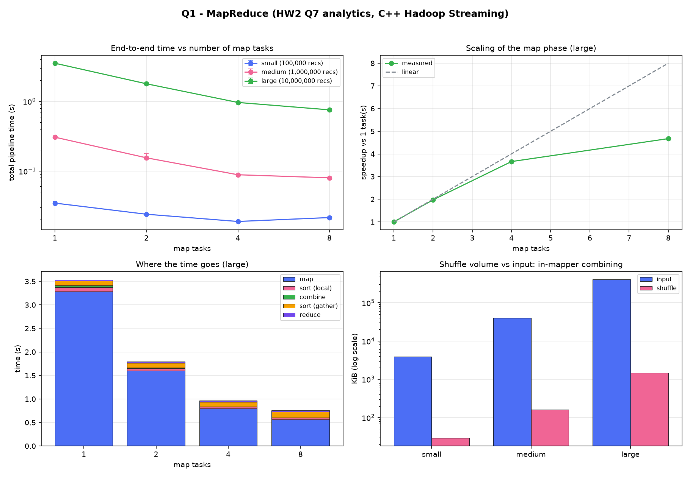

# Section 2 — Real-World Problem (HW2 Q7) in two paradigms

Our HW2 problem is **Q7, large-scale server log analytics**. Section 2 asks for the
same problem, same input, same analytics and the same output format, implemented
twice:

| | Paradigm | Data arrives | Directory |
| - | -------- | ------------ | --------- |
| **Q1** | Hadoop MapReduce (Hadoop Streaming, C++ mapper/reducer) | complete batch, before processing | [Q1_mapreduce/](Q1_mapreduce/) |
| **Q2** | gRPC streaming analytics (coordinator + workers + CLI dashboard) | continuous stream, processed live | [Q2_grpc/](Q2_grpc/) |

**Languages: Q1 in C++, Q2 in Python**, confirmed with the TA. The assignment
puts "Language: C++" under Q1's Required Environment, where the mapper and
reducer must be standalone C++ executables driven through Hadoop Streaming, and
prescribes no language for Q2.

Both must print **exactly** what the HW2 sequential program prints for the same
input, and both are checked by diffing against it.

This file was written **before** the code, so both implementations are built
against a fixed, written-down specification instead of against each other.

### Status — complete

| | Correctness vs `log_seq` | Headline result |
| - | ------------------------ | --------------- |
| **Q1** MapReduce (C++) | **34 / 34 checks** | 10M records in **0.756 s** with 8 map tasks (4.75× speedup); shuffle **278× smaller** than the input |
| **Q2** gRPC streaming (Python) | **76 / 76 checks** | **3.45M records/s** with 4 workers; queries answered at **p99 < 9 ms** during ingestion |
| **MPI** comparison (C++, reconstructed) | identical at 1, 2, 4, 8 processes | 10M records in 2.16 s at 8 processes |

Full analysis, tables and plots: **[REPORT.md](REPORT.md)**. How to build and
run everything: **[run.md](run.md)**.

## Contents

1. [The Q7 problem, exactly](#1-the-q7-problem-exactly)
2. [Requirements taken from the assignment](#2-requirements-taken-from-the-assignment)
3. [Planned structure](#3-planned-structure)
4. [Shared analytics core](#4-shared-analytics-core)
5. [Q1 — MapReduce design](#5-q1--mapreduce-design)
6. [Q2 — gRPC design](#6-q2--grpc-design)
7. [Correctness plan](#7-correctness-plan)
8. [Experiment plan](#8-experiment-plan)
9. [Datasets](#9-datasets)
10. [Results — Q1 (MapReduce)](#10-results--q1-mapreduce)
11. [Results — Q2 (gRPC)](#11-results--q2-grpc)
12. [Build and run](#12-build-and-run)

---

## 1. The Q7 problem, exactly

Recovered from the HW2 sources kept in [reference/](reference/), which are the
authority for every rule below: `common.h`, `common.cpp` (counting and printing),
`log_seq.cpp` (the sequential program) and `gen_dataset.cpp` (the generator).

### Input

```
N K S                                   first line
timestamp server_id endpoint_id user_id status_code response_time bytes_sent
...                                     N such lines
```

* `N` records, `K` = how many rows the Top-K lists show, `S` = number of servers.
* `timestamp` and `bytes_sent` are 64-bit; `response_time` is a decimal number of
  milliseconds (the generator writes 3 decimals); the ids are integers.

### Analytics

| Output line | Rule |
| ----------- | ---- |
| `TOTAL_REQUESTS` | number of records |
| `SUCCESSFUL_REQUESTS` | `status_code < 400` |
| `FAILED_REQUESTS` | `status_code >= 400` |
| `AVERAGE_RESPONSE_TIME` | sum of response times ÷ total, printed `%.6f`; `0.000000` when there are no records |
| `MIN_RESPONSE_TIME`, `MAX_RESPONSE_TIME` | smallest / largest response time, `%.6f`; both `0.000000` when there are no records |
| `TOTAL_BYTES` | sum of `bytes_sent` |
| `STATUS_2XX/3XX/4XX/5XX` | codes in 200–299, 300–399, 400–499, 500–599. A code outside all four ranges (e.g. 100 or 600) counts in the totals but in no bucket |
| `BUSIEST_INTERVAL id count` | `id = timestamp / 60` (C truncation, so negative timestamps truncate toward zero); the interval with the largest count; **ties go to the earliest interval**; `0 0` when there are no records |
| `TOP_SERVERS` | up to K rows `server_id count avg_response_time`, `%.6f` average |
| `TOP_ENDPOINTS` | up to K rows `endpoint_id count total_bytes` |

Ordering of both Top-K lists: **larger count first; on equal counts, smaller id
first**. Only ids with `count > 0` appear, so fewer than K rows are printed when
fewer ids occur. Records with a **negative** `server_id` or `endpoint_id` are
counted in the global totals but in neither per-id list.

### Output format

Exactly these lines, in this order, on stdout, nothing else:

```
TOTAL_REQUESTS <n>
SUCCESSFUL_REQUESTS <n>
FAILED_REQUESTS <n>
AVERAGE_RESPONSE_TIME <%.6f>
MIN_RESPONSE_TIME <%.6f>
MAX_RESPONSE_TIME <%.6f>
TOTAL_BYTES <n>
STATUS_2XX <n>
STATUS_3XX <n>
STATUS_4XX <n>
STATUS_5XX <n>
BUSIEST_INTERVAL <interval_id> <count>
TOP_SERVERS
<server_id> <count> <%.6f avg>      (≤ K rows)
TOP_ENDPOINTS
<endpoint_id> <count> <total_bytes> (≤ K rows)
```

The assignment states: *"Do not print debugging information as part of the
required output."* Progress messages, timings and status therefore go to
**stderr**, never stdout.

### The property both paradigms rely on

Every stored quantity is a **count, a sum, a minimum or a maximum**. All four
combine exactly when computed on separate pieces of the input and merged
afterwards. Averages are never stored, only computed at print time from a sum and
a count. This is what makes the same problem work as a MapReduce reduction and as
a merge of per-worker streaming state.

Two consequences that must be respected in both implementations:

* **Top-K is chosen after merging**, never from each part's local top K. A server
  that is second on every part can still be first overall.
* **The busiest interval is a maximum over merged counts**, with ties resolved to
  the earliest interval.

---

## 2. Requirements taken from the assignment

From `hw3-final.pdf`, Section 2. Each row is a requirement we must satisfy.

### Common to both

| # | Requirement |
| - | ----------- |
| C1 | Continue the same HW2 problem (Q7); input, analytics, output format and semantics unchanged |
| C2 | Implement **all** analytics of the HW2 problem |
| C3 | Explain and justify the design decisions in the README/report |
| C4 | Submit source, build/run instructions, correctness verification, performance results |
| C5 | No debugging output in the required output |
| C6 | Reproducible dataset generation: parameters, seeds, sizes documented |
| C7 | Documented well enough for another person to reproduce tests and experiments |

### Q1 — Hadoop MapReduce

| # | Requirement |
| - | ----------- |
| M1 | Apache Hadoop 3.3.6 with YARN as scheduler |
| M2 | **Language: C++** — mapper and reducer are standalone C++ executables |
| M3 | **Hadoop Streaming**: they talk to Hadoop over stdin/stdout |
| M4 | Decide and justify the mapper/reducer decomposition; one or more stages allowed |
| M5 | README explains: how input is processed by mappers, what intermediate data is produced, how reducers combine it, how the final analytics are obtained, any extra stages |
| M6 | **MPI vs MapReduce comparison** against the HW2 MPI program: execution time and throughput, scaling with input size, scaling with processes/tasks, memory, communication and data movement, programming complexity, flexibility |
| M7 | Benchmarks over multiple input sizes and Hadoop configurations, with tables/plots and explanations |

Note: the course has stated that Hadoop on RCE is currently broken and that a
**Slurm-based script may be used instead**. The design keeps the mapper and
reducer as pure stdin/stdout executables, so the identical binaries run under
Hadoop Streaming and under the Slurm pipeline.

### Q2 — gRPC

| # | Requirement |
| - | ----------- |
| G1 | Streaming client reads a pre-generated dataset and replays it as a live stream |
| G2 | gRPC server/coordinator receives the stream |
| G3 | **Multiple** analytics workers process the records |
| G4 | A mechanism for maintaining and combining analytics state |
| G5 | CLI dashboard displaying current analytics while the stream runs (no web UI) |
| G6 | Queries supported **while ingestion is in progress** |
| G7 | `.proto` interface supporting at minimum streaming ingestion and analytics queries; explain the choices |
| G8 | Final analytics after the full stream match a correct sequential implementation |
| G9 | Configurable control of **rate or granularity** of sending |
| G10 | Correct handling of concurrent updates and queries |
| G11 | Investigate: number of workers, record distribution strategy, message batch size, concurrent query clients |
| G12 | Measure: streaming throughput, query latency, end-to-end time, effect of worker count, granularity, concurrent queries, CPU/memory |

---

## 3. What is implemented, file by file

Q1 and the reference programs are C++; Q2 is Python. `bin/` is produced by the
build and is not in the repository.

| File | What it is | Lines |
| ---- | ---------- | ----- |
| **Shared** | | |
| [common/analytics.h](common/analytics.h) | the shared `Stats` box, how to add two of them together, and the `key<TAB>value` format they travel in | 99 |
| [common/analytics.cpp](common/analytics.cpp) | its implementation: merging, record parsing, writing and reading the pair format | 156 |
| **Q1 — MapReduce** | | |
| [Q1_mapreduce/mapper.cpp](Q1_mapreduce/mapper.cpp) | **the map step**: reads a split of the log file, counts every record (all the per-record logic is here), emits per-server / per-endpoint / per-interval aggregates | 127 |
| [Q1_mapreduce/combiner.cpp](Q1_mapreduce/combiner.cpp) | merges a mapper's own pairs before the shuffle; same format in and out | 35 |
| [Q1_mapreduce/reducer.cpp](Q1_mapreduce/reducer.cpp) | **the reduce step**: adds every mapper's pairs together, then works out the averages, the busiest interval and the Top-K lists and prints them | 149 |
| [Q1_mapreduce/run_hadoop.sh](Q1_mapreduce/run_hadoop.sh) | runs it as a real Hadoop Streaming job on YARN, then diffs against `log_seq` | 70 |
| **Q2 — gRPC (Python)** | | |
| [Q2_grpc/proto/loganalytics.proto](Q2_grpc/proto/loganalytics.proto) | the interface: `LogAnalytics` (public) and `Worker` (internal) | 211 |
| [Q2_grpc/src/analytics.py](Q2_grpc/src/analytics.py) | the Q7 analytics in Python: mergeable `Stats`, whole-number response times, exact output format | 207 |
| [Q2_grpc/src/coordinator.py](Q2_grpc/src/coordinator.py) | the gRPC server: routing, bounded queues, adding the workers up, queries, snapshots | 350 |
| [Q2_grpc/src/worker.py](Q2_grpc/src/worker.py) | an analytics worker: counts batches, hands back its running totals | 116 |
| [Q2_grpc/src/stream_client.py](Q2_grpc/src/stream_client.py) | replays a dataset as a live stream (rate, batch size, preload) | 185 |
| [Q2_grpc/src/query_client.py](Q2_grpc/src/query_client.py) | prints the analytics in HW2 format; also a query load tester | 158 |
| [Q2_grpc/src/dashboard.py](Q2_grpc/src/dashboard.py) | the terminal dashboard, redrawing live | 146 |
| **Reference (HW2, unchanged)** | | |
| [reference/log_seq.cpp](reference/log_seq.cpp), [reference/common.cpp](reference/common.cpp) | HW2's sequential program — the correctness baseline | 330 |
| [reference/log_mpi.cpp](reference/log_mpi.cpp) | the MPI program for the Q1-vs-MPI comparison (reconstructed; HW2's own is not in this folder) | 200 |
| [reference/gen_dataset.cpp](reference/gen_dataset.cpp) | HW2's dataset generator, fixed seeds | 106 |
| **Scripts** | | |
| [scripts/make_data.sh](scripts/make_data.sh) | generates tiny / small / medium / large with fixed seeds | |
| [scripts/verify_q1.sh](scripts/verify_q1.sh) | Q1 correctness: 34 checks against `log_seq` | |
| [scripts/verify_q2.py](scripts/verify_q2.py) | Q2 correctness: worker counts × strategies × batch sizes, concurrent sources, mid-stream queries | |
| [scripts/run_local.sh](scripts/run_local.sh) | starts Q2's coordinator and workers on one machine | |
| [scripts/rce_start.sh](scripts/rce_start.sh) | starts Q2's coordinator and workers across an allocation | |
| [scripts/bench_q1.sh](scripts/bench_q1.sh), [scripts/bench_q2.sh](scripts/bench_q2.sh) | the benchmark sweeps | |
| [scripts/plot.py](scripts/plot.py) | CSVs → `results/q1_plots.png`, `results/q2_plots.png` | |

```
Section2/
├── README.md              this file: spec, design, how to run, results
├── Makefile               reference tools + Q1 binaries
├── common/                the shared analytics core
├── Q1_mapreduce/          mapper, combiner, reducer, Hadoop runner
├── Q2_grpc/               proto/ and src/ (Python)
├── reference/             HW2 sources, unchanged = the correctness baseline
├── scripts/               data, verification, cluster runs, benchmarks, plots
├── tests/                 hand-made inputs: worked example + 5 edge cases
├── data/                  generated datasets (not in git)
├── bin/                   built binaries (not in git)
└── results/               verification output, benchmark CSVs, plots
```

## 4. Shared analytics core

`common/` holds only what the mapper, the combiner and the reducer genuinely
share: parsing a record line, the mergeable `Stats` structure (counts, sums, min,
max, and sparse per-server / per-endpoint / per-interval maps), adding two
`Stats` together, and writing and reading the `key<TAB>value` text they travel
in.

The logic that belongs to **one** step stays in that step's own file, so each
program can be read on its own:

| Logic | Where it lives |
| ----- | -------------- |
| counting one record — statuses, min/max, per-server, per-endpoint, per-minute | [Q1_mapreduce/mapper.cpp](Q1_mapreduce/mapper.cpp) (`count`) |
| the final report — averages, busiest interval, Top-K sorting, printing | [Q1_mapreduce/reducer.cpp](Q1_mapreduce/reducer.cpp) (`print_report`) |
| adding two partial results together | [common/analytics.cpp](common/analytics.cpp) (`Stats::add`) |

Q2 is Python and has its own [analytics.py](Q2_grpc/src/analytics.py), which
follows the same design. The two are kept honest not by sharing code but by both
being diffed against HW2's `log_seq` (§7).

Difference from HW2's version: HW2 sized dense vectors from a pre-scan of the
whole file, which a mapper or a streaming worker cannot do because neither sees
all the data. The shared core therefore keeps **sparse maps** keyed by id and
interval, which merge without knowing the ranges in advance.

## 5. Q1 — MapReduce design

> **"Hadoop Streaming" is not streaming data.** It is the name of the Hadoop
> interface that runs a mapper and a reducer as ordinary executables, feeding
> them through stdin and stdout, and it is what the assignment requires (M3). It
> is also the only reason C++ can be used here, since Hadoop's native API is
> Java. **Q1 is a batch job**: the whole dataset exists before the job starts,
> and each mapper reads its entire split before emitting anything. Continuous,
> live data exists only in Q2.

### The decomposition (M4, M5)

**One MapReduce stage.**

*Map.* Each mapper reads its split of the log file and counts the records into a
`Stats` (the shared core, §4). At the end of the split it emits only the
aggregates, as `key<TAB>value` text lines:

| Key | Value | Meaning |
| --- | ----- | ------- |
| `G` | total, success, failed, 2xx, 3xx, 4xx, 5xx, bytes, time sum, time min, time max | this split's global counters |
| `S:<id>` | count, summed response time | one per server seen |
| `E:<id>` | count, total bytes | one per endpoint seen |
| `I:<id>` | count | one per 60-second interval seen |
| `K` | K | only from the split holding the `N K S` header |

This is **in-mapper combining**, and it is the main design decision. The obvious
alternative — emit one key/value pair per record — would push all N records
through the sort and across the network, and the shuffle is the expensive part of
a MapReduce job. Here the number of pairs a mapper emits is bounded by the number
of *distinct* servers, endpoints and intervals in its split, never by the number
of records. For the 10M-record dataset that is a few thousand pairs instead of
ten million. It is correct for the reason in §1: every value is a count, sum, min
or max, so combining early changes nothing.

*Shuffle/sort.* Done by the framework. Keys are single tokens so that Hadoop
Streaming's default "first TAB separates key from value" rule works, and so text
sorting groups identical keys together.

*Combine.* The combiner merges pairs on the mapper's own node and emits the same
format it consumed, which is what lets the reducer be unable to tell whether it
ran. Safe because merging is associative and commutative.

*Reduce.* One reducer merges everything and prints the final analytics.

### Why a single reducer

Ten of the twelve outputs are global aggregates and could be split across
reducers. The two Top-K lists cannot: the top K servers can only be chosen once
*all* servers' counts are known, because a server ranked eleventh on every reducer
can still be first overall. Taking each reducer's local top K and merging those
would be wrong.

A single reducer is cheap here precisely because the mappers already reduced N
records down to one pair per distinct id. A second stage that ranks the merged
counts would only pay off if the number of distinct ids were itself large, which
it is not for this problem.

### The header line

The first line of the input is `N K S`, not a record. Under Hadoop only the split
containing the start of the file sees it. A header has 3 fields and a record has
7, so they are told apart by parsing, and the mapper that sees it forwards K to
the reducer as a `K` pair.

## 6. Q2 — gRPC design

```
 stream_client ──StreamRecords──▶ ┌── Coordinator ──┐ ──Process()──▶ Worker 0
 (replays the dataset)            │ router          │ ──Process()──▶ Worker 1
                                  │ bounded queues  │ ──Process()──▶ Worker 2
 dashboard ──WatchAnalytics────▶  │ adds workers up │ ◀──GetStats()───  (each
 query_client ──GetAnalytics───▶  └─────────────────┘                counts into
                                                                     its own Stats)
```

**Coordinator** (`Q2_grpc/src/coordinator.py`) does three jobs:

1. *Routing.* Each arriving batch goes on one worker's **bounded** queue, chosen
   by the strategy. One sender thread per worker drains its queue into a single
   long-lived `Worker.Process` stream, so no batch pays RPC setup. The bound is
   what gives **end-to-end backpressure**: a full queue blocks the put, the
   handler stops reading, and gRPC flow control slows the client. Memory stays
   bounded however fast the source sends (G10).
2. *Building the global answer.* When someone asks, it calls `GetStats` on every
   worker and adds the replies into one `Stats` — HW2's `MPI_Reduce`, done on
   demand instead of once at the end (G4).
3. *Answering queries while ingestion continues* (G6). Top-K is computed from the
   merged state, never from per-worker tops (§1).

**Workers** (`Q2_grpc/src/worker.py`) count batches into a mergeable `Stats` and hand
their running totals over when asked. They never talk to each other or to clients.

### Pull, not push — and why asking twice is safe

Each worker keeps its **own running totals** and always sends all of them.
`GetStats` therefore carries no sequence numbers and needs no acknowledgement:
the coordinator **replaces** that worker's contribution instead of adding to it,
so asking again — after a timeout, or just because a second query arrived —
cannot double-count anything.

An earlier version sent only *deltas*, numbered with an epoch the coordinator had
to acknowledge, with rules for a lost reply. Replacing rather than accumulating
makes the whole protocol unnecessary, which is why it is gone.

Pulling (rather than workers pushing) means a worker never needs to know who is
asking or how often, so query load and ingestion stay decoupled.

### Concurrency control (G10)

| Shared state | Protection |
| ------------ | ---------- |
| a worker's `Stats` (Process vs GetStats) | one mutex; a **whole batch** is counted atomically, so a query can never see half a batch |
| the coordinator's counters (records received, streams running, K) | one `threading.Lock` |
| worker queues | Python's `queue.Queue(maxsize=...)`, which already blocks on a full queue |

Several ingestion streams can be active at once; each runs on its own server
thread and they share the router.

### The `.proto` choices (G7)

See [Q2_grpc/proto/loganalytics.proto](Q2_grpc/proto/loganalytics.proto).

* **Client-streaming ingestion** — one RPC carries a whole stream, so per-batch
  connection and header costs disappear and flow control gives backpressure free.
* **Columnar `RecordBatch`** — one packed array per field. A 1000-record batch is
  7 packed arrays instead of 1000 sub-messages, which protobuf decodes in one go.
* **Integer micro-units** — no decimal ever crosses the wire, so merging is exact
  regardless of order (§1).
* **Both unary and server-streaming queries** — `GetAnalytics` suits scripts and
  latency measurement; `WatchAnalytics` suits the dashboard, which would
  otherwise poll, and costs one merge per refresh however many viewers there are.
* **A separate `Worker` service** — the coordinator↔worker protocol is internal
  and free to change; keeping it in its own service makes that boundary explicit.

### Distribution strategies (G11)

| Strategy | How | Cost at the coordinator |
| -------- | --- | ----------------------- |
| `round_robin` | whole batches in turn | O(1) per batch |
| `least_loaded` | whole batch to the shortest queue | O(W) per batch |
| `hash_server` | each record to `server_id % W` | O(records): the batch is split and re-encoded |

`hash_server` is what a system needs when per-key state must live on one worker.
Q7 needs no key affinity because every analytic is mergeable, so it is included
to be measured rather than because it is required.

### Streaming controls (G9)

`--batch-size B` (records per message, B=1 sends record by record), `--rate R`
(records/second), `--preload` (encode before the timer starts, so a benchmark
measures streaming and not file reading). Coordinator: `--strategy`,
`--queue-cap`.

## 7. Correctness plan

The rule for both questions: the printed analytics must be **byte-for-byte
identical** to `reference/log_seq` on the same input.

Planned coverage:

* the HW2 worked example;
* edge cases: empty input, a single record, negative ids, status codes outside all
  buckets, negative timestamps, bytes beyond 2³², ties in servers / endpoints /
  intervals, `K = 0`, `K` larger than the number of distinct ids;
* generated datasets at several sizes;
* Q1 across several mapper/reducer counts;
* Q2 across several worker counts, distribution strategies and batch sizes, plus
  queries issued mid-stream.

## 8. Experiment plan

* **Q1**: time per stage (map, shuffle/sort, combine, reduce) against input size
  and number of mappers/reducers; comparison with the HW2 MPI program on the same
  datasets (M6).
* **Q2**: throughput against worker count, message batch size and distribution
  strategy; query latency and its effect on ingestion; end-to-end time; CPU and
  memory (G12).
* Both on the RCE cluster with one process per node where possible.

## 9. Datasets

Generated by HW2's unchanged `gen_dataset` with fixed seeds, so they are
reproducible (C6). Parameters `N K S seed`, the resulting sizes and checksums are
recorded here once the datasets are regenerated.

Properties that matter: timestamps increase, so file order is chronological; about
one record in 2000 begins a burst of 3000 requests, which gives a clear busiest
interval; half the traffic goes to the first quarter of the servers, so per-server
load is skewed.

## 10. Results — Q1 (MapReduce)

Measured on an RCE compute node, 8 cores, C++ `-O2`. Each configuration was run
**3 times**; the tables show the **median**. The map tasks run as parallel
processes on one node, which is what `scripts/bench_q1.sh` does; the Slurm script
spreads the same stages across nodes. Raw data: `results/q1_bench.csv`, one row
per run, each with its own `correct` column — **all 36 runs matched `log_seq`**.



### 10.1 Scaling with map tasks

| Dataset | Records | 1 task | 2 tasks | 4 tasks | 8 tasks | speedup at 8 |
| ------- | ------: | -----: | ------: | ------: | ------: | -----------: |
| small   | 100,000 | 0.035 s | 0.024 s | 0.019 s | 0.021 s | 1.7× |
| medium  | 1,000,000 | 0.302 s | 0.152 s | 0.087 s | 0.079 s | 3.8× |
| large   | 10,000,000 | 3.534 s | 1.772 s | 0.946 s | 0.744 s | **4.8×** |

**Observations**

- **The map phase scales almost linearly while there is enough work.** On
  `large`, 1→2 tasks is 1.99× and 1→4 is 3.74×, close to ideal. The gain falls
  off at 8 (4.8× rather than 8×) because the serial tail — gathering every
  mapper's pairs, the final sort and the single reducer — does not shrink when
  mappers are added. That is Amdahl's law with a visible serial part, and the
  stacked plot shows exactly which part.
- **Small inputs stop improving immediately.** `small` is *slower* at 8 tasks
  than at 4: 100,000 records take about 7 ms to map, and process startup plus the
  gather costs more than the parallelism saves. MapReduce is a batch tool with a
  fixed overhead; it pays off from roughly a million records upward here.
- **The map phase dominates** at every size: 3.29 s of the 3.53 s total on
  `large` with 1 task (93%). Parsing the text input is the real work, which is
  why the C++ hand-written parser matters.

### 10.2 What in-mapper combining saves

| Dataset | Input | Shuffle (1 task) | Shuffle (8 tasks) | Reduction |
| ------- | ----: | ---------------: | ----------------: | --------: |
| small   | 3.9 MB | 29 KB | 93 KB | **135×** |
| medium  | 39 MB | 162 KB | 300 KB | **246×** |
| large   | 396 MB | 1.4 MB | 1.8 MB | **278×** |

**Observations**

- **The shuffle is 278× smaller than the input** on the 10M-record dataset, and
  the ratio *improves* as the input grows. This is the design decision from §5
  paying off: a mapper emits one pair per distinct server, endpoint and interval,
  never one per record, so the intermediate data is bounded by the *key space*
  and not by N. Emitting per-record pairs would have pushed ~400 MB through the
  sort and the network instead of 1.4 MB.
- **More mappers means slightly more shuffle** (1.4 MB → 1.8 MB on `large`),
  because each mapper emits its own partial for every key it sees, so keys get
  repeated across mappers. The growth is mild here since the key space (256
  servers, ~2000 endpoints, intervals) is small next to 10M records.
- The combiner has little left to do once in-mapper combining has run, which is
  why the combine stage is a thin band in the stacked plot. It is kept because it
  costs almost nothing and makes the job correct even if the mapper were changed
  to emit per-record pairs.

## 11. Build and run

### 11.1 Toolchain

| | Laptop | RCE cluster |
| - | ------ | ----------- |
| C++ compiler | g++ (C++11) | g++ 8.5.0 |
| Q1 (MapReduce) | builds and runs | builds and runs |
| Q2 (gRPC) | **cannot build** — no protoc, grpc++ or cmake | `module load gRPC/1.74.1 cmake/3.20.3` → protoc 31.1, grpc_cpp_plugin, libs in `/home/apps/grpc-1.74.1` |

RCE's default `python3` is 3.6 and irrelevant here: everything in Section 2 is
C++. Q2 must be built on RCE.

### 11.2 First-time setup on RCE

```bash
# from the laptop: copy the source across (data/ and bin/ are rebuilt there)
rsync -avz --exclude data --exclude bin --exclude build --exclude logs \
      Section2/ cs3401.26@rce.iiit.ac.in:~/HW3/Section2/

# on the RCE login node
ssh cs3401.26@rce.iiit.ac.in
cd ~/HW3/Section2
make                        # reference tools + Q1 mapper/combiner/reducer
bash scripts/make_data.sh   # tiny, small, medium, large (fixed seeds, ~2 min)

module load gRPC/1.74.1 cmake/3.20.3
cmake -S Q2_grpc -B Q2_grpc/build -DCMAKE_BUILD_TYPE=Release \
      -DCMAKE_PREFIX_PATH=/home/apps/grpc-1.74.1
cmake --build Q2_grpc/build -j 4        # the five gRPC binaries land in bin/
ls bin/                                 # 10 executables
```

### 11.3 Running Q1 — MapReduce

**The pipeline by hand** (one node; this is exactly what Hadoop chains together):

```bash
./bin/mapper < data/small.in | sort | ./bin/combiner | sort | ./bin/reducer
```

**Across cluster nodes with Slurm** (what the course allows while Hadoop on RCE
is broken). Mappers run in parallel on the allocated nodes, and it prints the
time of every stage:

```bash
sbatch scripts/run_slurm_q1.sh data/large.in     # 4 nodes
squeue -u $USER
cat results/q1_slurm_<jobid>.log
```

**As a real Hadoop Streaming job on YARN** (when Hadoop 3.3.6 is available):

```bash
export HADOOP_HOME=/path/to/hadoop-3.3.6
bash Q1_mapreduce/run_hadoop.sh data/medium.in
```

It puts the input in HDFS, runs `hadoop jar hadoop-streaming.jar` with the C++
binaries shipped by `-files`, prints the result and diffs it against `log_seq`.

**Correctness and benchmarks:**

```bash
make verify                        # 34 checks, 1-8 mappers, edge cases
sbatch scripts/bench_q1.sh         # the sweep -> results/q1_bench.csv
```

### 11.4 Running Q2 — gRPC (the RCE execution guide's layout)

**Step 1 — allocate nodes** (terminal A, and keep it open):

```bash
cd ~/HW3/Section2
salloc --nodes=4 --ntasks-per-node=1 --time=01:00:00
scontrol show hostnames $SLURM_JOB_NODELIST     # e.g. node01 node02 node03 node06
```

**Step 2 — start the servers.** The first node is the coordinator, the rest are
workers:

```bash
bash scripts/rce_start.sh                  # 1 worker per node, round_robin
# or: bash scripts/rce_start.sh 2 least_loaded
```

Or start each by hand, one terminal each, which shows their output live:

```bash
ssh node02;  cd ~/HW3/Section2;  ./bin/worker 0.0.0.0:50061
ssh node03;  cd ~/HW3/Section2;  ./bin/worker 0.0.0.0:50061
ssh node01;  cd ~/HW3/Section2;  ./bin/coordinator 0.0.0.0:50051 \
                 --workers node02:50061,node03:50061 --strategy round_robin
```

**Step 3 — run the clients**, each in its own terminal (`ssh <node>; cd
~/HW3/Section2`). Use the coordinator's **hostname**, never `localhost`:

```bash
./bin/dashboard     node01:50051                                    # live dashboard
./bin/stream_client node01:50051 data/medium.in --rate 100000 --wait # the stream
./bin/query_client  node01:50051                                    # query mid-stream
./bin/query_client  node01:50051 --status                           # + system state
./bin/query_client  node01:50051 --final                            # the final answer
```

**Step 4 — check against HW2, then stop:**

```bash
./bin/query_client node01:50051 --final > logs/grpc.txt
./bin/log_seq data/medium.in | diff - logs/grpc.txt && echo SAME
bash scripts/rce_start.sh stop
exit                                    # releases the nodes
```

**Correctness and benchmarks:**

```bash
bash scripts/verify_q2.sh               # inside an allocation
sbatch scripts/bench_q2_job.sh data/medium.in    # 6 nodes -> results/q2_bench.csv
```

### 11.5 Plots

```bash
python3 scripts/plot.py                 # -> results/q1_plots.png, q2_plots.png
```

### 11.6 Things that bite

| Symptom | Cause and fix |
| ------- | ------------- |
| `Access denied by pam_slurm_adopt` | you can only `ssh` to nodes in your current allocation — `salloc` first |
| client hangs or `UNAVAILABLE` | wrong host (use `node01`, not `localhost`), or the coordinator is not up — check `logs/coordinator.log` |
| counts are 2× or 3× what they should be | a previous stream's state is still there. Stream with `--reset`, or restart the servers. Inside `salloc`, an `srun` without `--ntasks=1` also starts one client per task |
| `address already in use` | an old server is still running: `pkill -u $USER -f 'bin/(worker|coordinator)'` on that node |
| a script that backgrounds a server over ssh never returns | write `cd X; nohup … &`, not `cd X && nohup … &` — with `&&` the whole list is backgrounded and the subshell holds ssh's streams open |
