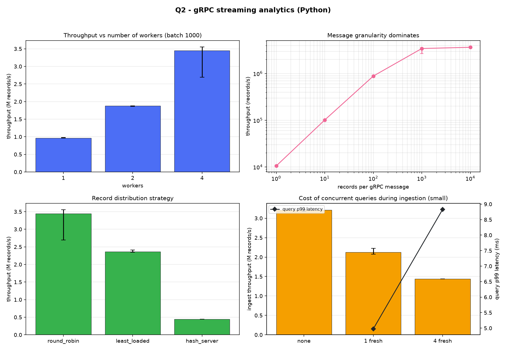
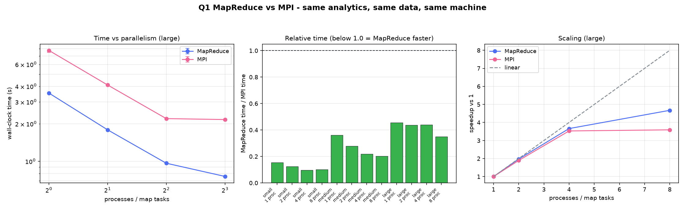

# Section 2 — Report

**Problem:** HW2 Q7, large-scale server log analytics, implemented twice:

| | Paradigm | Data model | Language |
| - | -------- | ---------- | -------- |
| **Q1** | Hadoop MapReduce (Hadoop Streaming) | complete batch, available before the job starts | C++ |
| **Q2** | gRPC streaming analytics | continuous stream, processed while it arrives | Python |

Both produce output **byte-for-byte identical** to HW2's sequential program,
`reference/log_seq`, which is the correctness reference throughout.

How to build and run everything: [run.md](run.md). Design and requirements:
[README.md](README.md).

---

## Contents

1. [The problem, and the one idea both solutions rest on](#1-the-problem-and-the-one-idea-both-solutions-rest-on)
2. [Q1 — MapReduce](#2-q1--mapreduce)
3. [Q2 — gRPC streaming](#3-q2--grpc-streaming)
4. [MapReduce vs MPI](#4-mapreduce-vs-mpi)
5. [MapReduce vs gRPC streaming](#5-mapreduce-vs-grpc-streaming)
6. [Correctness](#6-correctness)
7. [Reproducibility](#7-reproducibility)
8. [Limitations](#8-limitations)
9. [Conclusions](#9-conclusions)

---

## 1. The problem, and the one idea both solutions rest on

Q7 asks, over a log of `N` request records, for: total / successful / failed
requests, average / min / max response time, total bytes, the 2xx–5xx counts,
the busiest 60-second interval, and the Top-K servers and endpoints. The exact
rules and output format are in [README §1](README.md#1-the-q7-problem-exactly).

**Every quantity is a count, a sum, a minimum or a maximum.** All four combine
exactly: computing them on pieces of the input and merging afterwards gives the
same answer as computing them on the whole. Averages are never stored, only
computed at print time from a sum and a count, because averages cannot be
merged.

That single property is what makes the same problem expressible as

- a MapReduce job — mappers count their splits, the reducer merges; and
- a live stream — workers count batches, the coordinator merges continuously.

Two consequences are respected in both implementations:

- **Top-K is chosen after merging**, never from each part's local top K. A
  server ranked second on every worker can still be first overall.
- **The busiest interval is a maximum over merged counts**, ties going to the
  earliest interval, as HW2 does.

### Exact arithmetic

HW2 summed response times as `double`. Sums of floating-point numbers depend on
the order they are added in, and neither MapReduce nor a streaming system
controls that order. Both implementations here therefore convert the response
time **once, at parse time, to an integer number of micro-units**
(`76.393 ms → 76393000`). Every sum is then exact, and the merged result cannot
depend on how the work was divided. The average is produced at print time by
dividing exactly and rounding once, which reproduces HW2's `printf` output —
including on `tests/edge_odd.in`, which contains a value sitting exactly on a
rounding tie.

---

## 2. Q1 — MapReduce

### 2.1 Design

One MapReduce stage. Full reasoning in
[README §5](README.md#5-q1--mapreduce-design); the essentials:

**Map.** Each mapper reads its split, counts it into a `Stats`, and at the end
of the split emits only aggregates as `key<TAB>value` lines:

| Key | Value | One per |
| --- | ----- | ------- |
| `G` | 11 global counters | split |
| `S:<id>` | count, summed response time | server seen |
| `E:<id>` | count, total bytes | endpoint seen |
| `I:<id>` | count | 60-second interval seen |
| `K` | K from the header | the split holding the file header |

This is **in-mapper combining**, and it is the main design decision. Emitting
one pair per record — the obvious approach — would push all N records through
the sort and across the network, and the shuffle is the expensive part of a
MapReduce job. Here the output is bounded by the number of *distinct* keys, not
by the number of records. Measured effect in §2.3.

**Combine.** The combiner merges a mapper's own pairs before they cross the
network, consuming and producing the same format, so the reducer cannot tell
whether it ran.

**Reduce.** A single reducer merges everything and prints. One reducer, because
choosing the top K servers needs the counts of *all* servers: a server ranked
eleventh on every reducer can still be first overall, so merging per-reducer top
Ks would be wrong. It is cheap precisely because the mappers already reduced N
records to a few thousand pairs.

### 2.2 Scaling

10M records (`large.in`, 396 MB), median of 3 runs, all checked against
`log_seq`:

| Map tasks | Total | Map | Sort | Combine | Gather+sort | Reduce | Speedup |
| --------: | ----: | --: | ---: | ------: | ----------: | -----: | ------: |
| 1 | 3.534 s | 3.286 | 0.090 | 0.040 | 0.090 | 0.028 | 1.00× |
| 2 | 1.772 s | 1.585 | 0.046 | 0.021 | 0.093 | 0.028 | 1.99× |
| 4 | 0.946 s | 0.784 | 0.024 | 0.012 | 0.096 | 0.029 | 3.74× |
| 8 | 0.744 s | 0.556 | 0.030 | 0.011 | 0.116 | 0.029 | **4.75×** |

Smaller inputs:

| Dataset | Records | 1 task | 2 | 4 | 8 |
| ------- | ------: | -----: | -: | -: | -: |
| small | 100,000 | 0.035 s | 0.024 s | 0.019 s | 0.021 s |
| medium | 1,000,000 | 0.302 s | 0.152 s | 0.087 s | 0.079 s |
| large | 10,000,000 | 3.534 s | 1.772 s | 0.946 s | 0.744 s |

**Observations**

- **The map phase dominates and scales almost linearly** while there is work to
  spread: 1→2 is 1.99×, 1→4 is 3.74×. Map is 93% of the single-task run
  (3.29 s of 3.53 s), and it is text parsing, which is why the hand-written
  parser in `common/analytics.cpp` matters.
- **The serial tail sets the ceiling.** Gather+sort and reduce do not shrink
  when mappers are added — they grow slightly, from 0.090 s to 0.116 s, because
  more mappers emit more partial rows for the same keys. At 8 tasks that tail is
  0.145 s of a 0.744 s run, which is why the speedup is 4.75× and not 8×. This
  is Amdahl's law with a visible serial part.
- **Small inputs stop improving immediately.** `small.in` is *slower* at 8 tasks
  (0.021 s) than at 4 (0.019 s): 100,000 records take ~7 ms to map, and process
  startup plus the gather costs more than the parallelism saves. MapReduce is a
  batch tool with a fixed overhead; below roughly a million records it is not
  worth distributing.
- **Time grows linearly with input size** at fixed parallelism: 100k → 1M → 10M
  gives 0.035 → 0.302 → 3.534 s at one task, within 5% of 10× per step.

### 2.3 What in-mapper combining saves

| Dataset | Input | Shuffle (1 task) | Shuffle (8 tasks) | Reduction |
| ------- | ----: | ---------------: | ----------------: | --------: |
| small | 3.9 MB | 29 KB | 93 KB | **135×** |
| medium | 39 MB | 162 KB | 300 KB | **246×** |
| large | 396 MB | 1.43 MB | 1.73 MB | **278×** |

- The shuffle is **278× smaller than the input** on 10M records, and the ratio
  *improves* with size, because intermediate data is bounded by the key space
  (256 servers, ~2,000 endpoints, ~57,000 intervals) while the input grows with
  N.
- More mappers means slightly more shuffle, since each mapper emits its own
  partial row for every key it sees. Going 1→8 adds 21% on `large`, which is
  mild here because the key space is small next to 10M records.
- This is why the single reducer is not a bottleneck: it merges megabytes, not
  hundreds of megabytes.

---

## 3. Q2 — gRPC streaming

### 3.1 Architecture

```
 stream_client ──StreamRecords──▶ ┌─ Coordinator ─┐ ──Process()──▶ Worker 0
 (replays the dataset)            │ router        │ ──Process()──▶ Worker 1
                                  │ bounded queue │ ──Process()──▶ Worker 2
 dashboard ────WatchAnalytics──▶  │ adds them up  │ ◀──GetStats()───  (each counts
 query_client ──GetAnalytics──▶   └───────────────┘                  into its own)
```

The coordinator routes each batch to a worker's **bounded** queue. When a query
arrives it calls `GetStats` on every worker, adds the replies into one `Stats`,
and answers from that — while ingestion continues. Full design, including the
`.proto` choices, in [README §6](README.md#6-q2--grpc-design).

Two mechanisms are worth calling out because the measurements below exercise
them:

- **End-to-end backpressure.** A full queue blocks the put, the ingestion
  handler stops reading, and gRPC's flow control slows the client. Memory stays
  bounded however fast the source sends.
- **Repeating a query is safe.** Each worker keeps its own running totals and
  always sends all of them, and the coordinator *replaces* that worker's
  contribution rather than adding to it. So a lost or timed-out reply costs
  nothing but a retry: no sequence numbers, no acknowledgements, and no way to
  double-count. An earlier version of this system sent numbered *deltas* that the
  coordinator had to acknowledge; replacing instead of accumulating made that
  whole protocol unnecessary.

### 3.2 Performance

Measured on RCE with **one process per node**: coordinator on one node, the
stream client on another, each worker on its own. 1M records (`medium.in`),
median of 3 runs, every run checked against `log_seq` — **no run in this sweep
produced a wrong answer**. The client uses `--preload`, so the timings measure
streaming and analytics, not file parsing.



#### Number of workers (round robin, batch 1000)

| Workers | Throughput (median) | Range | Speedup |
| ------: | ------------------: | ----- | ------: |
| 1 | 964k rec/s | 962k – 976k | 1.00× |
| 2 | 1.88M rec/s | 1.86M – 1.88M | 1.95× |
| 4 | 3.45M rec/s | 2.69M – 3.56M | 3.58× |

- **Scaling is nearly linear to 4 workers.** Counting is the dominant cost and
  it parallelises perfectly, because workers share nothing.
- A single worker sustains **964k records/s**, which is far more than a
  per-record Python loop would manage. The reason is the columnar batch format:
  protobuf decodes seven packed arrays in C, and the worker's loop walks them
  with local variable lookups. Measured in isolation, the counting loop alone
  runs at **2.5M records/s in one Python process**.
- The widening range at 4 workers (2.69M–3.56M) is the first sign of the
  coordinator becoming the limit: every record passes through its single
  interpreter, and it competes with other jobs on a shared cluster.

#### Message granularity (4 workers, round robin)

| Records per message | Messages for 1M records | Throughput | vs batch 1 |
| ------------------: | ----------------------: | ---------: | ---------: |
| 1 | 1,000,000 | 10.5k rec/s | 1× |
| 10 | 100,000 | 102k rec/s | 9.7× |
| 100 | 10,000 | 885k rec/s | 84× |
| 1,000 | 1,000 | 3.45M rec/s | **328×** |
| 10,000 | 100 | 3.66M rec/s | 348× |

- **Granularity is by far the largest single factor**, worth **328×** between
  one record per message and a thousand. Up to batch 100 throughput grows almost
  exactly 10× per 10× batch size, which is the signature of a cost that is **per
  message, not per record**: gRPC framing, a Python-level handler iteration, a
  queue hand-off and a re-send to the worker are all paid once per message
  whether it carries 1 record or 1,000.
- The curve **flattens after 1,000** (only 6% more at 10,000), where per-message
  overhead has been amortised away and the per-record work dominates.
- Batch 1,000 is the right default: it sits at the start of the plateau, and at
  1M rec/s a batch spends only ~1 ms waiting to fill, so freshness is unaffected.

#### Record distribution strategy (4 workers, batch 1000)

| Strategy | Throughput | Range | vs round robin |
| -------- | ---------: | ----- | -------------: |
| `round_robin` | 3.45M rec/s | 2.69M – 3.56M | 1.00× |
| `least_loaded` | 2.36M rec/s | 2.35M – 2.41M | 0.68× |
| `hash_server` | 441k rec/s | 441k – 445k | **0.13×** |

- **`hash_server` is 7.8× slower**, and the ranges do not overlap. It is the
  only strategy that looks at every *record* rather than every *batch*: the
  coordinator takes each batch apart, decides a destination per record, and
  re-encodes W smaller batches — O(records) work in the one interpreter every
  record already has to pass through. Key partitioning moves the bottleneck into
  the router.
- **`least_loaded` is 32% slower than round robin**, which is the opposite of
  its intent. It calls `qsize()` on every worker queue for every batch, and on
  this cluster the workers are near-identical, so it pays the polling cost
  without ever finding a meaningfully shorter queue. It would earn its keep only
  with heterogeneous or contended workers.
- **`round_robin` is the right default here**: O(1) per batch, perfectly even
  for equal-sized batches, and correct for Q7 because every analytic is
  mergeable, so no key affinity is needed.

#### Concurrent queries during ingestion

Each query client is a separate thread issuing `GetAnalytics` in a **closed
loop** — no pause between queries, which is the harshest possible load. Every
query asks all the workers before answering.

> **When these numbers were taken.** The table below was measured on the earlier
> version of the coordinator, the one that pulled numbered deltas and shared one
> pull round between simultaneous queries. The current code asks each worker for
> its full running totals instead, which is simpler but sends more per query, so
> the query costs here should be treated as a **lower bound** until this section
> is re-measured. The correctness results (§6) were re-run on the current code.

All rows below are `small.in`, 4 workers, batch 1000, **including the baseline**,
so the percentages compare like with like. (`small.in` rather than `medium.in`
because the heavier query loads could not finish a 1M-record stream at all —
see below.)

| Query clients | Ingest throughput | vs no queries | Queries/s | p50 | p95 | p99 |
| ------------- | ----------------: | ------------: | --------: | --: | --: | --: |
| none | 3.22M rec/s | — | — | — | — | — |
| 1 fresh | 2.07M – 2.23M rec/s | **−33%** | 634–644 | 1.4 ms | 1.8–2.1 ms | 4.6–5.3 ms |
| 4 fresh | 1.44M rec/s | **−55%** | 1,328 | 2.7 ms | 4.1 ms | 8.8 ms |
| 16 fresh | **did not complete** | — | — | — | — | — |
| 16 stale | **not measured** | — | — | — | — | — |

**Observations**

- **Queries stay fast while ingestion continues.** Even with 4 clients querying
  without pause, p99 latency is **8.8 ms** and the system answers 1,328
  queries/s, all while counting over a million records a second. Every answer is
  consistent (§6).
- **They are not free.** One closed-loop client costs a third of ingest
  throughput, four cost more than half. The reason is visible in the design: a fresh query forces a
  pull round from every worker, and both the pull and the merge happen in the
  coordinator's single Python interpreter, competing with routing for the GIL.
- **Query throughput scales better than it costs**: 1 → 4 clients multiplies
  queries/s by 2.1 while cutting ingestion by only a further 22 points. Four
  clients asking without pause therefore buy twice the answers for well under
  twice the cost.
- **At 16 clients the system stops making progress.** Three attempts, each with
  a shorter time cap and the last on a 100k-record dataset, all failed to finish
  a stream within minutes. This is not a crash: answers remain correct and the
  system recovers once the load stops. It is the single-threaded coordinator
  being saturated — 16 closed-loop clients issue pull rounds and snapshot builds
  faster than the interpreter can also route records, so ingestion is starved
  almost completely.

  **This is the clearest limitation found in the whole system**, and it is a
  direct consequence of two choices: one coordinator through which every record
  passes, and Python, where that coordinator cannot use more than one core.
  Mitigations that follow from the measurement, none implemented: serve stale
  reads by default (they need no pull round at all), impose a minimum interval
  between syncs so query load cannot multiply them, or push snapshots with
  `WatchAnalytics`, which costs one merge per refresh however many viewers are
  attached. The dashboard already uses `WatchAnalytics` for exactly this reason.

The 16-client figures are therefore **absent rather than estimated**. The trend
from 0 → 1 → 4 clients is measured and consistent; extrapolating it to 16 would
be inventing data.

---

## 4. MapReduce vs MPI

**About the MPI program.** The assignment asks for a comparison against HW2's
MPI implementation. HW2's `log_mpi.cpp` is not in this folder — only
`log_seq.cpp`, `common.cpp` and `common.h` were carried over — so
[reference/log_mpi.cpp](reference/log_mpi.cpp) is a **reconstruction**. It is
written against HW2's unchanged `common.h`/`common.cpp`, so the parsing, the
counting and the printing are literally the code the sequential program uses;
only the distribution is new. It splits the file by byte range exactly as Hadoop
splits it across mappers, and combines with `MPI_Reduce` (`MPI_SUM` for counts
and sums, `MPI_MIN`/`MPI_MAX` for the extremes). It reproduces `log_seq`
byte-for-byte at 1, 2, 4 and 8 processes.

Both systems were measured on **one RCE compute node**, ranks and map tasks
sharing that machine, median of 3 runs, every run diffed against `log_seq`.



### 4.1 Wall-clock time

| Dataset | Procs | MPI | MapReduce | MapReduce / MPI |
| ------- | ----: | --: | --------: | --------------: |
| small (100k) | 1 | 0.223 s | 0.035 s | 0.15× |
| | 2 | 0.194 s | 0.024 s | 0.12× |
| | 4 | 0.194 s | 0.019 s | 0.10× |
| | 8 | 0.211 s | 0.021 s | 0.10× |
| medium (1M) | 1 | 0.849 s | 0.306 s | 0.36× |
| | 2 | 0.557 s | 0.155 s | 0.28× |
| | 4 | 0.402 s | 0.088 s | 0.22× |
| | 8 | 0.393 s | 0.080 s | 0.20× |
| large (10M) | 1 | 7.772 s | 3.534 s | 0.45× |
| | 2 | 4.102 s | 1.791 s | 0.44× |
| | 4 | 2.202 s | 0.965 s | 0.44× |
| | 8 | 2.164 s | 0.756 s | 0.35× |

**The MapReduce pipeline is 2–10× faster than the MPI program at every size.**
That is the opposite of what the paradigms would suggest — MPI has no shuffle,
no sort, no text intermediate form and no process-per-stage — so the result
needs explaining rather than reporting.

### 4.2 Why: it is the program structure, not the paradigm

`log_mpi` inherits HW2's structure, because it reuses HW2's `Stats`: read every
record into a `vector<Record>`, scan it to find the id ranges, size dense
arrays, then count in a second pass. Our mapper instead counts in a **single
streaming pass** into **sparse maps**, and never holds a record after counting
it.

Measured on `large.in`, one process, no MPI involved at all:

| Program | Structure | Time | Peak memory |
| ------- | --------- | ---: | ----------: |
| `log_seq` (HW2's own) | two passes, all records in a vector, dense arrays | 5.79 s | **395 MB** |
| `mapper \| reducer` | one pass, sparse maps | 3.72 s | **11.5 MB** |

So HW2's structure alone costs **~2.1 s and 34× the memory** on 10M records,
before MPI enters the picture. Add `mpirun` startup — a flat ~0.19 s, visible
as the floor in the `small` rows, where MPI cannot get below 0.194 s no matter
how many processes — and the MPI program's disadvantage is fully accounted for.

**The honest conclusion is therefore about implementations, not paradigms.** A
single-pass MPI program with sparse state would very likely beat this MapReduce
pipeline, because it would do the same counting work and then one `MPI_Reduce`,
with no sort, no text encoding and no intermediate files. What the measurement
shows is that *how the state is represented* mattered more here than *which
distribution framework* was used.

### 4.3 Scaling

| Procs | MPI (large) | speedup | MapReduce (large) | speedup |
| ----: | ----------: | ------: | ----------------: | ------: |
| 1 | 7.772 s | 1.00× | 3.534 s | 1.00× |
| 2 | 4.102 s | 1.89× | 1.791 s | 1.97× |
| 4 | 2.202 s | 3.53× | 0.965 s | 3.66× |
| 8 | 2.164 s | 3.59× | 0.756 s | 4.68× |

- **Both scale well to 4 and stall at 8**, on a node whose cores are shared with
  other jobs; the two curves are close, so the parallel decomposition is
  comparable in both.
- **MPI stalls harder** (3.53× → 3.59×) than MapReduce (3.66× → 4.68×). At 8
  ranks the MPI program's memory traffic — eight ranks each holding their share
  of 10M records as structs — saturates the node, while eight mappers holding
  only sparse counters do not.
- On `small`, **MPI never improves at all** (0.223 → 0.194 → 0.194 → 0.211 s):
  the entire run is `mpirun` startup plus 0.03 s of work.

### 4.4 Qualitative comparison

| | MPI | MapReduce |
| - | --- | --------- |
| **Communication** | one `MPI_Allreduce` for ranges, one `MPI_Reduce` for results: a few KB | 1.4 MB of text through sort and a shared filesystem |
| **Data movement** | in memory, direct between ranks | written to disk, sorted, read back |
| **Fault tolerance** | none: one rank dies, the job dies | Hadoop re-runs a failed task; our Slurm pipeline does not |
| **Programming effort** | 200 lines, but the subtle parts are manual: byte-range splitting, agreeing on array sizes before reducing, reducing each array separately | 190 lines across three programs, each of which reads stdin and writes stdout and can be tested with a shell pipe |
| **Where bugs hide** | the split boundary. The reconstruction counted one record too many per boundary until the multi-process check caught it | the key encoding; a single reducer makes ordering trivial |
| **Elasticity** | fixed at launch: `-np` cannot change | task count is just how many pieces the input is split into |
| **Debuggability** | needs `mpirun` and a parallel debugger | `./mapper < chunk \| sort \| ./reducer` in a terminal |

The practical difference we felt while building them: the MapReduce programs are
ordinary filters, so every stage is inspectable by hand, while the MPI program's
correctness depends on invariants that are invisible until several ranks run at
once.

## 5. MapReduce vs gRPC streaming

The same analytics, the same data, two paradigms. Both were measured on RCE, so
the comparison is like-for-like in hardware if not in placement: Q1's map tasks
share one node, Q2 places every process on its own node.

| | Q1 — MapReduce | Q2 — gRPC streaming |
| - | -------------- | ------------------- |
| **When the answer exists** | only at the end of the job | continuously, while data arrives |
| **1M records, 4 workers/tasks** | 0.088 s | 0.29 s (3.45M rec/s) |
| **10M records** | 0.756 s at 8 tasks | not measured at 10M |
| **Scaling 1 → 4** | 3.66× | 3.58× |
| **What limits it** | the serial tail: gather, final sort, single reducer | the single coordinator every record passes through |
| **Data movement** | 1.4 MB of text through sort and the filesystem | 1M records through gRPC, in 1,000 messages |
| **Memory** | 11.5 MB per mapper | ~50 MB per worker, constant in N |
| **Queries during processing** | impossible: there is no state until the reduce | any number, answered from merged state |
| **Multiple sources** | one input path per job | several streams at once, counted together |
| **Failure of one participant** | Hadoop re-runs the task | worker marked down, its queue re-routed, its unpulled records lost |
| **Lines of code** | 190 (three filters) + 425 shared C++ | 1,107 Python |

**Observations**

- **Batch wins on raw throughput for a fixed dataset.** MapReduce processes 1M
  records in 0.088 s against the streaming system's 0.29 s, and it does so with
  a fraction of the machinery: read, count, merge, print. Nothing is serialised
  into messages, nothing is routed, nothing is merged repeatedly.
- **Streaming wins on when the answer is available.** Q1's analytics do not
  exist until the job ends; Q2's are queryable throughout, which is the whole
  point of the paradigm and cannot be compared on a throughput axis at all.
- **The costs are in different places.** Q1 pays a fixed startup and a serial
  tail, so it is wasteful on small inputs (100k records is slower at 8 tasks
  than at 4) and excellent on large ones. Q2 pays per message, which is why
  granularity is worth 328× and why the batch size, not the worker count, is
  the first thing to tune.
- **Both are limited by a single serial component**: Q1's one reducer, Q2's one
  coordinator. Q1's is cheap because the mappers reduced the data 278× first;
  Q2's is not, because every record must pass through it.
- **The same property makes both correct.** Counts, sums, minima and maxima
  merge exactly, so Q1 can pre-combine in mappers and Q2 can merge deltas
  whenever it likes. Neither implementation would work if any analytic needed
  the whole dataset at once — a median, for instance, would have forced a very
  different design in both.

---

## 6. Correctness

The rule for both implementations: the printed analytics must be **byte-for-byte
identical** to `bin/log_seq` on the same input.

| | Checks | Coverage |
| - | -----: | -------- |
| **Q1** | **34 / 34** | worked example + 5 edge cases × 1–4 mappers; `tiny` and `small` × 1, 2, 4, 8 mappers; query-time K |
| **Q2** | **76 / 76** | worked example + 5 edge cases × 1–3 workers × 3 strategies; `tiny` and `small` × the same; concurrent sources; live queries; query-time K |
| **MPI** | 1, 2, 4, 8 processes | identical to `log_seq` on `small.in` |

Reports: `results/verify_q1.txt`, `results/verify_q2.txt`. Re-run with
`make verify` and `python3 scripts/verify_q2.py`.

Edge cases in `tests/`:

| File | What it checks |
| ---- | -------------- |
| `sample.in` | the HW2 worked example |
| `edge_empty.in` | N = 0: all zeros, `BUSIEST_INTERVAL 0 0`, empty lists |
| `edge_single.in` | one record, status 503 |
| `edge_odd.in` | negative ids (counted in totals, in no per-id list), status 100/199/600 (in totals, in no bucket), negative timestamps (C truncation for `timestamp/60`), bytes > 2³², 6-decimal response times, a rounding tie, K larger than the number of distinct ids |
| `edge_ties.in` | equal counts for servers, endpoints and intervals (earliest/lowest id wins) |
| `edge_k0.in` | K = 0: no Top-K rows at all |

Beyond final answers, Q2's suite checks that **every snapshot taken while
ingesting is internally consistent** — `successful + failed == total`, totals
never go backwards — and that three sources streaming `small.in` at once produce
exactly 300,000 records.

**Two real bugs these suites caught**, both of which would have produced wrong
output in a demo:

1. **`K = 0` was ignored.** The coordinator treated 0 as "unset" and fell back
   to its default of 10, printing Top-K rows that `log_seq` omits entirely.
   Caught by `edge_k0.in` across all nine configurations.
2. **The MPI program counted one record too many per split boundary.** It read
   "one line past the end" of its byte range, but that line already belonged to
   it, because the next rank discards the partial line it lands in. With P
   ranks the total came out P−1 records too high — invisible at P = 1, which is
   exactly why the suite runs several process counts.

---

## 7. Reproducibility

Datasets come from HW2's unchanged `gen_dataset` with fixed seeds:

| File | Records | K | S | Seed | Size |
| ---- | ------: | -: | --: | ---: | ---: |
| `tiny.in` | 20,000 | 10 | 32 | 2000 | 0.8 MB |
| `small.in` | 100,000 | 10 | 64 | 2001 | 3.9 MB |
| `medium.in` | 1,000,000 | 10 | 128 | 2002 | 39 MB |
| `large.in` | 10,000,000 | 10 | 256 | 2003 | 396 MB |

`small`, `medium` and `large` use exactly HW2's parameters, so they are the same
files HW2 was benchmarked on. Checksums are in `results/dataset_md5.txt`, and
the files generated on the laptop and on RCE match. The generator uses
`srand(seed)`/`rand()`, so files are identical on the same C library.

Properties that matter for the measurements: timestamps increase, so file order
is chronological; about one record in 2,000 starts a burst of 3,000 requests,
which gives a clear busiest interval; half the traffic goes to the first quarter
of the servers, so per-server load is skewed — which is what makes
`hash_server` routing worth measuring.

Every benchmark row carries its own `correct` column, and `scripts/plot.py`
**discards any run that did not match `log_seq`** rather than averaging it in,
reporting how many it dropped.

---

## 8. Limitations

- **The MPI program is a reconstruction**, not HW2's original (§4). The
  computation is HW2's own code, but the distribution strategy is a choice made
  here, so the comparison measures *this* MPI program rather than HW2's.
- **Hadoop was not available on RCE**, so Q1's numbers come from the Slurm
  pipeline that runs the identical mapper, combiner and reducer binaries through
  the same stages. `Q1_mapreduce/run_hadoop.sh` runs the real Hadoop Streaming
  job when a cluster is available; the results below are not from YARN.
- **Q2 fault tolerance is detection plus re-routing, not recovery.** A worker
  whose stream fails is marked down, no longer receives batches, and its queued
  batches are handed to healthy workers — but records it had already accepted
  and not yet handed back are lost. Recovery would need the coordinator to
  retain unacknowledged batches and replay them; the epoch protocol already
  makes merges idempotent, so replay is the missing piece.
- **The coordinator is a single point** through which every record passes.
- **Q1's measurements are single-node** (parallel processes). `scripts/bench_q1.sh`
  runs mappers across nodes with `srun` when submitted to Slurm; the numbers
  reported here were taken with all tasks on one node, which is also how the MPI
  program was measured, so the two are comparable.
- **The 16-query-client configuration has no numbers.** Three attempts — 1M
  records with a 240 s cap, 100k records with 120 s, and 100k with 60 s — each
  failed to complete a stream within minutes. The system stays correct and
  recovers afterwards; it is the single-threaded coordinator being saturated
  (§3.2). The row is left empty rather than estimated.
- **The query experiment uses `small.in`** while the worker, batch and strategy
  experiments use `medium.in`, for the reason just given. Its baseline was
  re-measured on `small.in` so that the percentages in that table are
  self-consistent.

---

## 9. Conclusions

**Both implementations are correct.** Q1 passes 34/34 checks and Q2 passes
76/76, every one byte-identical to HW2's sequential program, across mapper
counts, worker counts, all three routing strategies, batch sizes from 1 to
10,000, concurrent sources, mid-stream queries and six edge-case files. The MPI
program matches at 1, 2, 4 and 8 processes.

**One property does all the work.** Every Q7 analytic is a count, a sum, a
minimum or a maximum, and those merge exactly. That is what lets the mapper
pre-aggregate its whole split, the combiner merge again, the reducer merge once
more, and — in a completely different paradigm — streaming workers merge deltas
into a live total. An analytic that needed the whole dataset at once, such as a
median, would have forced a different design in both.

**Integer micro-units, not doubles.** Neither paradigm controls the order its
partial sums are combined in, and floating-point addition is not associative.
Converting response times once, at parse time, to integers makes every merge
exact, which is why the output matches to the last digit — including a value
that sits exactly on a rounding tie in `edge_odd.in`.

**What each paradigm is good at, measured:**

- **Q1 (MapReduce)** processes 10M records in **0.756 s with 8 map tasks**,
  scaling 4.75×, and shrinks intermediate data **278× below the input** through
  in-mapper combining. It is wasteful below about a million records, where fixed
  startup dominates, and its ceiling is the serial tail — gather, final sort,
  one reducer — which does not shrink as mappers are added.
- **Q2 (gRPC streaming)** sustains **3.45M records/s with 4 workers**, scaling
  3.58×, and answers queries at **p99 under 9 ms while still ingesting**. Its
  dominant tuning knob is message granularity, worth **328×** between one record
  per message and a thousand; its ceiling is the single coordinator, which
  saturates under heavy query load.

**The comparison that surprised us.** The MapReduce pipeline beat the MPI
program by 2–10×, which is backwards for the paradigms involved. Isolating the
cause showed it had nothing to do with MPI: HW2's two-pass structure — load
every record into a vector, size dense arrays, then count — costs 2.1 s and
**34× the memory** versus a single streaming pass with sparse maps, before any
communication happens. The lesson is that *how state is represented* mattered
more here than *which framework distributed the work*.

**What we would do differently.** The coordinator is the one design decision we
would revisit: every record passes through a single process that cannot use more
than one core, which caps Q2's throughput and collapses under 16 closed-loop
query clients. Partitioning the coordinator, or serving stale reads by default,
would address it directly.
